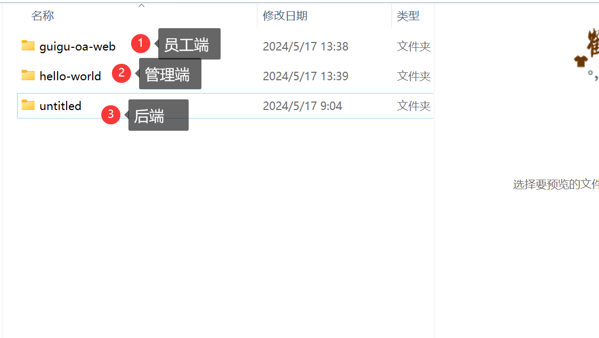
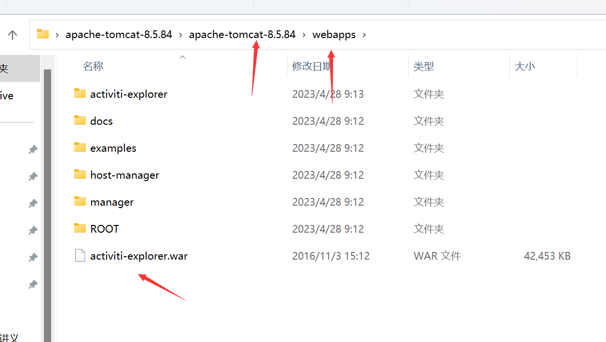
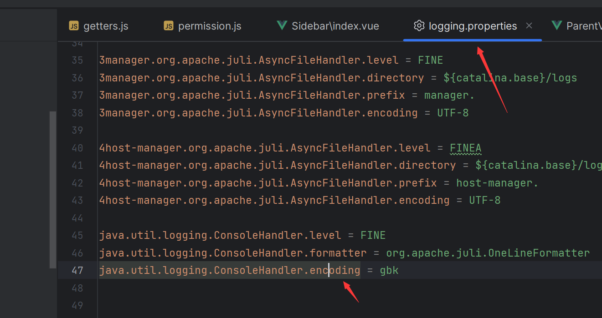
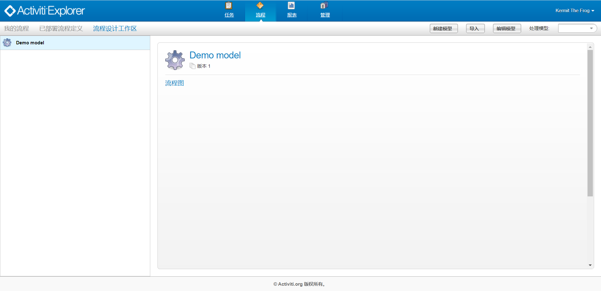
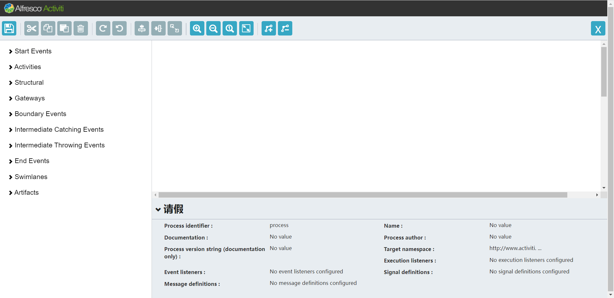
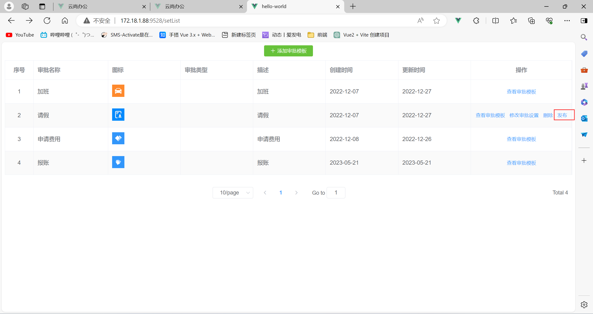
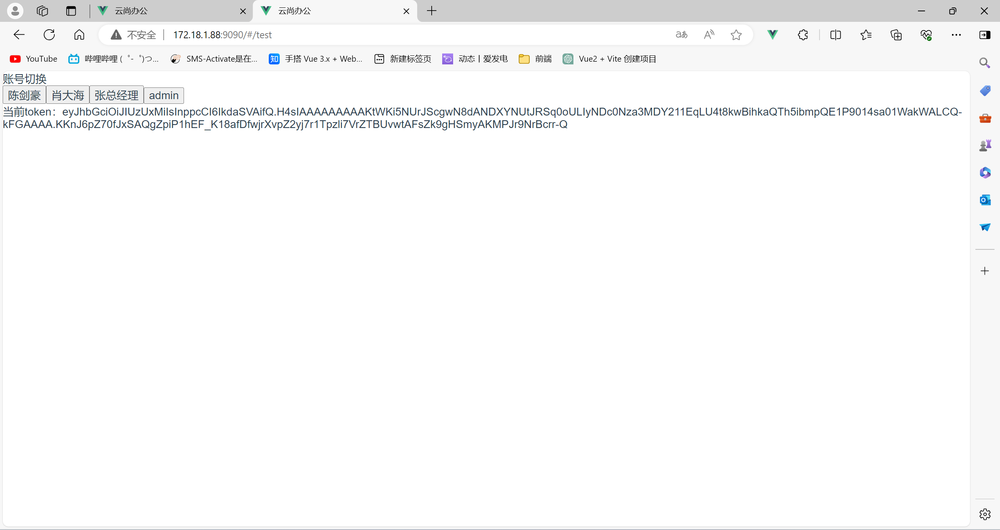
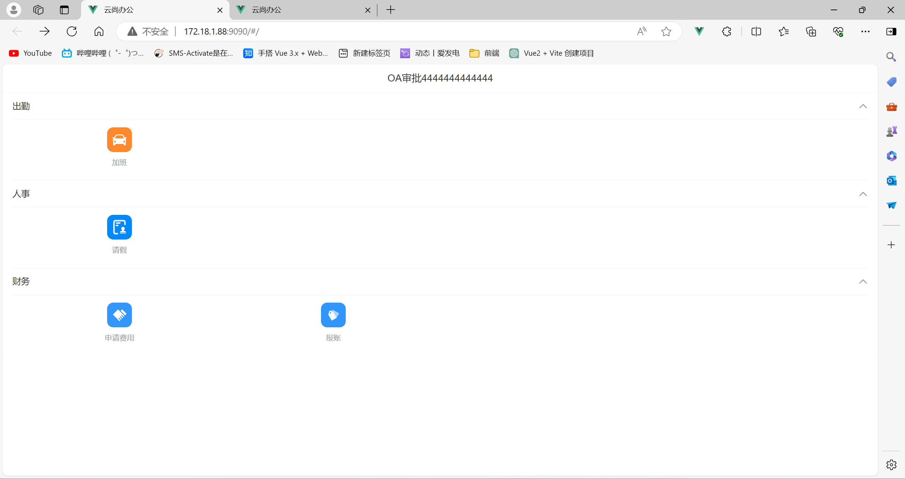

# 一、搭建activiti 流程图构建平台

##### 1.4.3、部署activiti-explorer.war

将activiti-explorer.war放到tomcat部署目录，启动tomcat

控制台改为中文编码

##### 1.4.4、访问activiti-explorer

http://localhost:8080/activiti-explorer

默认登录账号：kermit	kermit

上面有很多功能，我们关注流程设计即可，如下图：

点击上图：流程 --> 新建模型 --> 输入模型名称（请假）--> 创建

构建流程那些。

# 二、管理端

## 2.1登录管理端

操作查看地址：http://172.18.1.88:9528/

模版地址：http://172.18.1.88:9528/typeList

## 2.2 添加审批模版

地址：http://172.18.1.88:9528/setList

## 2.3  发布审批流程

假如我们创建了审批模版，我们就可以直接进行发布

# 三，员工端

 员工进行登录提交审批或者高领审批员工提交申请

3.1 账号切换页面 地址: http://172.18.1.88:9090/#/test

选择之后就可以直接访问以下地址了

员工端主页：http://172.18.1.88:9090/#/

