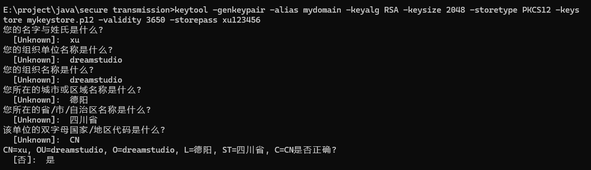
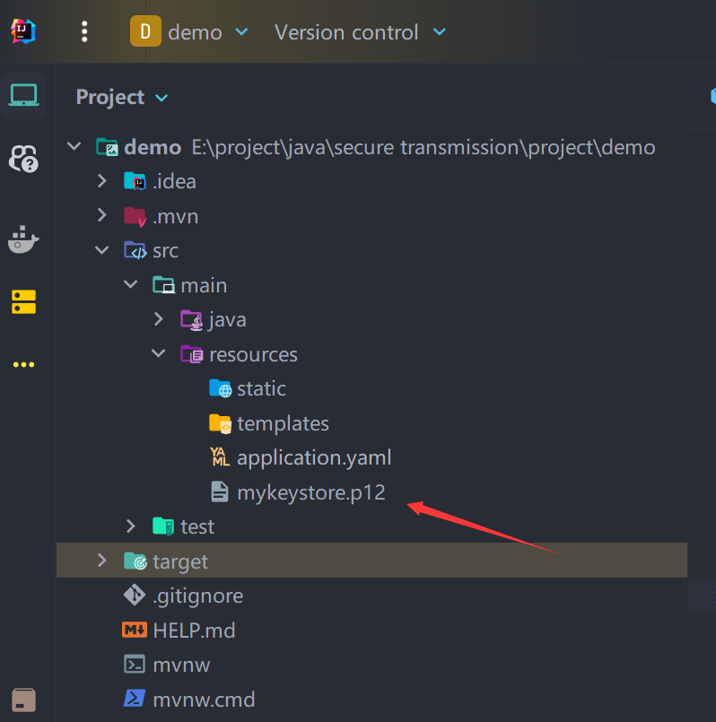
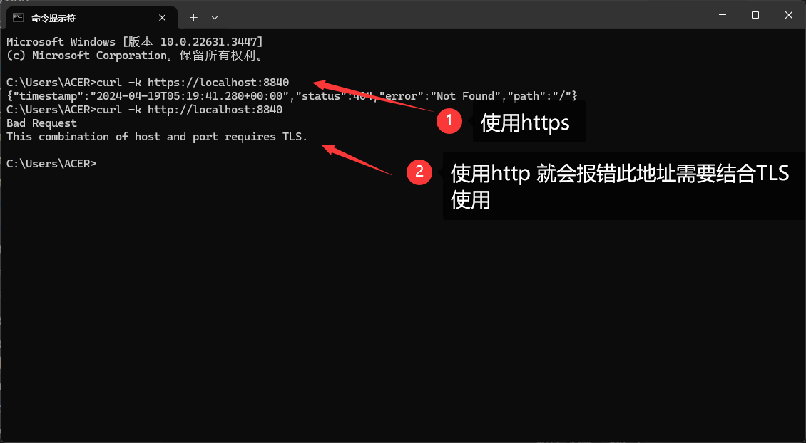
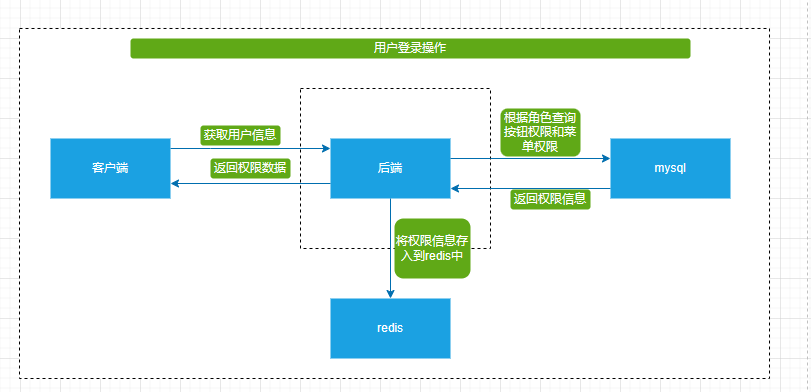
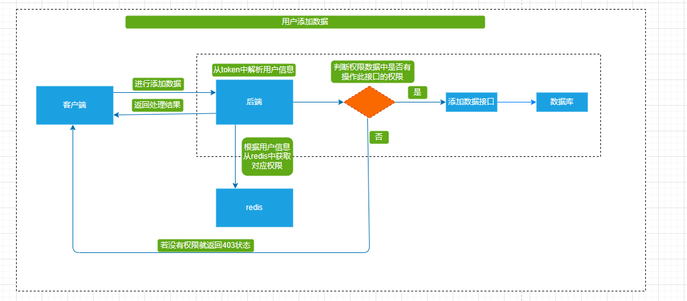

# 一、md5 与 先进的哈希算法的区别

**先进的hash算法有（ bcrypt、PBKDF2 或 Argon2）**

实际上，使用 bcrypt、PBKDF2 或 Argon2 进行密码散列与使用 MD5 有着显著的区别，主要在于安全性和适用性。虽然 MD5 曾广泛用于密码散列，但它现在被认为是不安全的选择，主要原因如下：

## 1.1. **安全性问题**

- **快速计算**：MD5 设计用于快速计算文件或数据的散列值，这使得它在抵抗暴力破解攻击方面表现不佳。攻击者可以使用现代的硬件在极短的时间内尝试数十亿个密码组合。
- **碰撞弱点**：MD5 已经被证明存在碰撞弱点，即可以找到两个不同的输入产生相同的输出。这种特性使其不适合进行密码存储或任何需要高安全性的场景。

## 1.2. **设计目的**

- **MD5**：最初设计为快速计算数据的散列，用于检查文件完整性，而非密码存储。
- **bcrypt/PBKDF2/Argon2**：特别为密码存储设计，包括对抗散列速度过快的攻击手段，如密钥拉伸和盐值使用，这些都是为了增加密码破解的难度。

## 1.3. **功能特性**

- **密钥拉伸**：bcrypt、PBKDF2 和 Argon2 实现了密钥拉伸功能，可以通过增加计算的时间和资源需求来有效抵抗暴力破解攻击。
- **盐值使用**：这些算法在散列密码时使用盐值，可以有效防止彩虹表攻击，即使是两个相同的密码，在加了不同的盐之后，产生的散列值也会不同。

## 1.4. **适用性**

- **广泛适用**：虽然你提到“大多数项目都是使用 MD5 进行加密”，但实际上，在安全性意识提高和数据泄露事件频发的当下，许多现代应用和安全标准推荐使用 bcrypt、PBKDF2 或 Argon2 作为密码存储的首选方法。

## 1.5. 总结

如果你在设计一个需要存储用户密码的系统，强烈建议使用 bcrypt、PBKDF2 或 Argon2 而不是 MD5。这些现代算法提供了更高级别的安全保障，可以帮助你的系统抵御当前的威胁，如暴力破解和彩虹表攻击。选择正确的密码存储策略是保护用户数据安全的关键一步。


# 二、数据传输安全和数据加密实现：

## 2.1 生成证书：

1. 执行命令

   ```
   keytool -genkeypair -alias mydomain -keyalg RSA -keysize 2048 -storetype PKCS12 -keystore mykeystore.p12 -validity 3650 -storepass yourpassword
   ```

   **命令详解：**

   - `keytool`: 这是 Java 提供的一个用于管理密钥和证书的命令行工具。
   - `-genkeypair`: 这个参数告诉 keytool 生成一个密钥对，包括一个公钥和一个相应的私钥。
   - `-alias mydomain`: 这个参数指定了密钥对的别名。在之后的操作中，可以使用这个别名来引用这个密钥对。
   - `-keyalg RSA`: 这个参数指定了要使用的密钥算法。在这种情况下，RSA 算法被选用。
   - `-keysize 2048`: 这个参数指定了生成的密钥的位长度。在这个例子中，密钥的长度为 2048 位。
   - `-storetype PKCS12`: 这个参数指定了密钥库的类型。在这里，选择了 PKCS#12 格式。
   - `-keystore mykeystore.p12`: 这个参数指定了要生成的密钥库的文件名。在这个例子中，生成的密钥库将被命名为 `mykeystore.p12`。
   - `-validity 3650`: 这个参数指定了生成的证书的有效期限。在这里，证书的有效期限被设置为 3650 天（大约 10 年）。
   - `-storepass yourpassword`: 这个参数指定了密钥库的密码。在这个例子中，密码被设置为 `yourpassword`。请确保将 `yourpassword` 替换为你自己的密码。
   - 


## 2.2、在springboot中进行集成

### 2.2.1 配置证书：

1. 将生成的证书放置在resource目录下

2. 配置yaml

   ```yaml
   spring:
     application:
       name: demo
   
   server:
     ssl:
       key-store: "src/main/resources/mykeystore.p12"
       key-store-password: xu123456
       keyStoreType: PKCS12   # 存储加密信息的标准文件格式
       keyAlias: mydomain # 别名用于从密钥库中引用具体的密钥
     port: 8840
   ```

3. 启动项目并使用cmd 进行测试

**总结：** 

​	完成以上操作后我们的所有的请求 都需要使用https进行访问。


### 2.2.2. 强制使用 HTTPS

#### 2.2.2.1 实现过程

1. 首先导入本次项目所需要的所有依赖

   ```xml
   <dependencies>
           <dependency>
               <groupId>org.springframework.boot</groupId>
               <artifactId>spring-boot-starter-jdbc</artifactId>
           </dependency>
           <dependency>
               <groupId>org.springframework.boot</groupId>
               <artifactId>spring-boot-starter-web</artifactId>
           </dependency>
   
           <dependency>
               <groupId>mysql</groupId>
               <artifactId>mysql-connector-java</artifactId>
               <version>8.0.30</version>
           </dependency>
           <dependency>
               <groupId>org.springframework.boot</groupId>
               <artifactId>spring-boot-configuration-processor</artifactId>
               <optional>true</optional>
           </dependency>
           <dependency>
               <groupId>org.springframework.boot</groupId>
               <artifactId>spring-boot-starter-test</artifactId>
               <scope>test</scope>
           </dependency>
   
           <dependency>
               <groupId>com.baomidou</groupId>
               <artifactId>mybatis-plus-boot-starter</artifactId>
               <version>3.4.1</version>
           </dependency>
   
           <dependency>
               <groupId>com.github.xiaoymin</groupId>
               <artifactId>knife4j-spring-boot-starter</artifactId>
               <version>3.0.3</version>
           </dependency>
   
           <dependency>
               <groupId>org.projectlombok</groupId>
               <artifactId>lombok</artifactId>
           </dependency>
   
           <dependency>
               <groupId>org.springframework.boot</groupId>
               <artifactId>spring-boot-starter-security</artifactId>
           </dependency>
           <dependency>
               <groupId>org.springframework.security</groupId>
               <artifactId>spring-security-config</artifactId>
           </dependency>
   
           <dependency>
               <groupId>com.alibaba</groupId>
               <artifactId>fastjson</artifactId>
               <version>2.0.21</version>
           </dependency>
   
       </dependencies>
   ```

2. 配置yaml文件

   ```yaml
   spring:
     application:
       name: demo
   
     datasource:
       password: '123456'
       driver-class-name: com.mysql.cj.jdbc.Driver
       url: jdbc:mysql://localhost:3306/ceshi?useUnicode=true&characterEncoding=UTF-8&serverTimezone=Asia/Shanghai
       username: root
     mvc:
       format:
         date: yyyy-MM-dd
         date-time: yyyy-MM-dd HH:mm:ss
   
   server:
     port: 8840 # HTTP端口
     ssl:
       enabled: true
       port: 8843 # HTTPS端口
       key-store: "src/main/resources/mykeystore.p12"
       key-store-password: xu123456
       keyStoreType: PKCS12
       keyAlias: mydomain
   ```

3. 搭建security配置文件 `WebSecurityConfig`

   1. 考虑在你的应用中强制使用 HTTPS，以避免数据通过不安全的 HTTP 发送。在 Spring Security 中，可以通过配置安全性策略来实现：

      ```java
      @EnableWebSecurity
      public class WebSecurityConfig extends WebSecurityConfigurerAdapter {
          @Override
          protected void configure(HttpSecurity http) throws Exception {
              http
                  .requiresChannel() //指定了需要使用的通道类型
                  .anyRequest() // 指定了所有的请求
                  .requiresSecure(); // 指定了需要使用安全的HTTPS通道
          }
      }
      ```

**这样配置后，所有请求都会被重定向到 HTTPS (即使用户输入http)。**


### 2.2.3 使用bcrypt 进行密码加密

#### 2.2.3.1实现过程

1. 创建密码加密配置文件  `SecurityConfig ` 在添加用户业务中可以使用此 `BCryptPasswordEncoder.encode()` 方法进行加密用户密码并存储在数据库中

   ```java
   package com.example.demo.config.passwordEncoder;
   
   import org.springframework.context.annotation.Bean;
   import org.springframework.context.annotation.Configuration;
   import org.springframework.security.config.annotation.web.builders.HttpSecurity;
   import org.springframework.security.crypto.bcrypt.BCryptPasswordEncoder;
   import org.springframework.security.crypto.password.PasswordEncoder;
   
   /**
    * @author CaptureOrNew
    * @description //进行密码加密配置
    * @date 19:29:12 2024/4/19
    * @return null
    **/
   @Configuration
   public class SecurityConfig {
   
       // 进行编码配置 创建一个BCryptPasswordEncoder的实例
       @Bean
       public PasswordEncoder passwordEncoder() {
           return new BCryptPasswordEncoder();
       }
   
       // 配置其他安全措施...
   }
   
   ```

2. 创建一个密码编辑器

   ```java
   package com.example.demo.security.custom;
   
   
   import com.example.demo.config.passwordEncoder.SecurityConfig;
   import org.springframework.beans.factory.annotation.Autowired;
   import org.springframework.security.crypto.password.PasswordEncoder;
   import org.springframework.stereotype.Component;
   
   /**
    * @author CaptureOrNew
    * @description //创建一个bcrypt 加密器
    * @date 19:28:21 2024/4/19
    * @Param
    * @return null
    **/
   @Component
   public class CustomBcryptPasswordEncoder implements PasswordEncoder {
   
       @Autowired
       SecurityConfig securityConfig;
   
       // 进行密码加密操作
       public String encode(CharSequence rawPassword) {
           return securityConfig.passwordEncoder().encode(rawPassword.toString());
       }
   
       // 进行密码比对
       public boolean matches(CharSequence rawPassword, String encodedPassword) {
           // security 会自动进行密码的比对
           return securityConfig.passwordEncoder().matches(rawPassword, encodedPassword);
       }
   }
   
   ```

3. 创建一个 UserDetailsService 接口 以及下面的实现类进行 数据库用户查询和一些鉴权判断

   ```java
   package com.example.demo.security.custom;
   
   import org.springframework.security.core.userdetails.UserDetails;
   import org.springframework.security.core.userdetails.UsernameNotFoundException;
   import org.springframework.stereotype.Component;
   
   @Component
   public interface UserDetailsService extends org.springframework.security.core.userdetails.UserDetailsService {
   
       /**
        * 根据用户名获取用户对象（获取不到直接抛异常）
        */
       @Override
       UserDetails loadUserByUsername(String username) throws UsernameNotFoundException;
   }
   ```

4. 实现类

   ```java
   package com.example.demo.service.impl;
   
   
   import com.example.demo.model.model.SysUser;
   import com.example.demo.security.custom.CustomUser;
   import com.example.demo.service.SysUserService;
   import org.springframework.beans.factory.annotation.Autowired;
   import org.springframework.security.core.authority.SimpleGrantedAuthority;
   import org.springframework.security.core.userdetails.UserDetails;
   import org.springframework.security.core.userdetails.UserDetailsService;
   import org.springframework.security.core.userdetails.UsernameNotFoundException;
   import org.springframework.stereotype.Service;
   
   import java.util.ArrayList;
   import java.util.List;
   
   @Service
   public class UserDetailsServiceImpl implements UserDetailsService {
   
       @Autowired
       private SysUserService sysUserService;
   
   
       @Override
       public UserDetails loadUserByUsername(String username) throws UsernameNotFoundException {
           //根据用户名进行查询
           SysUser sysUser = sysUserService.getUserByUserName(username);
           if(null == sysUser) {
               throw new UsernameNotFoundException("用户名不存在！");
           }
   
           if(sysUser.getStatus().intValue() == 0) {
               throw new RuntimeException("账号已停用");
           }
   
           List<SimpleGrantedAuthority> authList = new ArrayList<>();
           return new CustomUser(sysUser, authList);
       }
   }
   
   ```


#### 2.2.3.2 BCryptPasswordEncoder 的实现逻辑

1. **加密 (`encode`) 过程**：
   - 用户提供一个明文密码。
   - 生成一个随机盐值（通常是每次加密时生成的）。
   - 使用明文密码和生成的盐值，通过 BCrypt 算法进行多轮散列处理。
   - 将盐值和散列结果合并成一个字符串（通常在字符串中包含盐值、散列值和用于 BCrypt 的成本参数）。
   - 返回这个合并后的字符串作为最终的存储散列。
2. **验证 (`matches`) 过程**：
   - 用户尝试登录时提供一个明文密码。
   - 取出数据库中存储的散列密码，这个散列包含了用于该特定密码的盐值。
   - 使用存储的盐值和用户提供的明文密码再次执行相同的 BCrypt 散列过程。
   - 比较新生成的散列结果与存储的散列值是否一致。
   - 如果两者一致，说明密码匹配，用户验证成功；如果不一致，则验证失败。
3. 流程图：

```lua
                    +-----------------------+
                    |       用户注册        |
                    +-----------------------+
                    | 输入明文密码          |
                    +-----------------------+
                           ↓
                    +-----------------------+
                    | 生成随机盐值          |
                    +-----------------------+
                           ↓
                    +-----------------------+
                    | 使用 BCrypt 加密      |
                    | (密码 + 盐值)         |
                    +-----------------------+
                           ↓
                    +-----------------------+
                    | 存储散列密码到数据库  |
                    +-----------------------+
                           ↓
                    +-----------------------+
                    |       用户登录        |
                    +-----------------------+
                    | 输入明文密码          |
                    +-----------------------+
                           ↓
                    +-----------------------+
                    | 读取存储的散列密码    |
                    | (包含盐值)            |
                    +-----------------------+
                           ↓
                    +-----------------------+
                    | 使用读取的盐值重新    |
                    | 加密输入的明文密码    |
                    +-----------------------+
                           ↓
                    +-----------------------+
                    | 比较两个散列值是否相同|
                    +-----------------------+
                           ↓
                    +-----------------------+
                    | 相同: 验证成功        |
                    | 不同: 验证失败        |
                    +-----------------------+

```


# 三、权限控制：

**以下操作基于RBAC （角色访问控制） 权限管理模型**  

给用户分配角色 ——> 给角色分配权限（可对项目进行的操作）

## 3.1、菜单权限控制

在用户每次登录系统获取信息时，后端通过用户名和密码在数据库中进行查找此用户，如果查询到此用户就根据用户所处的角色及角色所能操作的菜单查询出来将查询到的菜单组装为前端的路由形式进行返回给前端。这样就实现了根据用户的身份角色不同，客户端就会展示相应的菜单等。

### 3.1.1具体步骤：

1. 用户登录后紧接着获取菜单信息
2. 从请求头获取用户信息即token
3. 从数据在token中解析出登录用户的ID
4. 根据ID查询用户信息
5. 根据用户信息查询用户可操作的菜单
6. 组装菜单并返回
7. 前端通过动态路由的形式进行插入到项目中。


## 3.2、按钮权限：

根据用户可以操作的按钮进行来控制那些后端方法也就是接口是可以被用户所访问的（CURD）。

### 3.2.1 具体步骤：

1. 前端中会根据用户登录后获取信息的接口获取到按钮权限。在前端中使用获取到的按钮权限信息对相应的按钮进行禁用或其他操作

2. 我们后端中 security 配置类 TokenAuthenticationFilter 中进行配置获取用户按钮权限的操作并存入到security 身上 

   ```java
   @Override
       protected void doFilterInternal(HttpServletRequest request,
                                       HttpServletResponse response,
                                       FilterChain chain) throws ServletException, IOException {
           //如果是登录接口，直接放行
           if ("/admin/system/index/login".equals(request.getRequestURI())) {
               chain.doFilter(request, response);
               return;
           }
           // 获取校验信息
           UsernamePasswordAuthenticationToken authentication = getAuthentication(request);
           if (null != authentication) {
               SecurityContextHolder.getContext().setAuthentication(authentication);
               chain.doFilter(request, response);
           } else {
               ResponseUtil.out(response, Result.build(null, ResultCodeEnum.LOGIN_ERROR));
           }
       }
   
       private UsernamePasswordAuthenticationToken getAuthentication(HttpServletRequest request) {
   
           //请求头是否有token
           String username = request.getHeader("token");
   
           if (!StringUtils.isEmpty(username)) {
               String authListString = request.getHeader("authorities");
               if (!StringUtils.isEmpty(authListString)) {
                   System.out.println(authListString+"================>");
                   String ccc = authListString;
                   //把redis获取字符串权限数据转换要求集合类型 List<SimpleGrantedAuthority>
                   List<Map> maplist = JSON.parseArray(ccc, Map.class);
                   System.out.println(maplist);
                   List<SimpleGrantedAuthority> authList = new ArrayList<>();
                   for (Map map : maplist) {
                       String authority = (String) map.get("authority");
                       authList.add(new SimpleGrantedAuthority(authority));
                   }
                   return new UsernamePasswordAuthenticationToken(username, null, authList);
               } else {
                   return new UsernamePasswordAuthenticationToken(username, null, new ArrayList<>());
               }
           }
           return null;
       }
   ```

3. 这样我们就可以直接调用security中的一个注解进行 校验： 

   ```java
   @PreAuthorize("hasAuthority('bnt.sysUser.list')")    
   
   
   
   /**
        * @author CaptureOrNew
        * @description //查询用户列表
        * @date 09:46:22 2024/4/20
        * @PreAuthorize 标注在方法上，表示访问方法的用户需要有对应的权限
        * @return com.example.demo.result.Result<java.util.List < com.example.demo.model.model.SysUser>>
        **/
       @PreAuthorize("hasAuthority('bnt.sysUser.list')")
       @GetMapping("getUserList")
       public Result<List<SysUser>> getUserList() {
           List<SysUser> list = sysUserService.list();
           return list != null ? Result.ok(list) : Result.build(null, LOGIN_ERROR);
       }
   ```

4. 测试验证数据   这里我们是将权限放在header中了 ，没有使用redis

   ```js
   const axios = require('axios');
   
   let config = {
     method: 'get',
     maxBodyLength: Infinity,
     url: 'https://localhost:8840/admin/getUserList',
     headers: { 
       'token': 'admin', 
       'authorities': '[{"authority":"bnt.sysUser.remove"},{"authority":"bnt.sysUser.add"},{"authority":"bnt.sysUser.update"}]'
     }
   };
   
   axios.request(config)
   .then((response) => {
     console.log(JSON.stringify(response.data));
   })
   .catch((error) => {
     console.log(error);
   });
   
   ```


**验证逻辑**

```
[{"authority":"bnt.sysUser.list"},
{"authority":"bnt.sysUser.remove"},
{"authority":"bnt.sysUser.add"},
{"authority":"bnt.sysUser.update"}]
```


### 3.2.2 流程图

1. 用户登录
2. 用户添加


# 别的

## **在Springboot中使用Argon2进行密码加密 不依靠 SpringScurity**

### 1. 添加 Argon2 库的依赖

如果你的项目中使用 Java，你可以添加如下依赖（例如使用 `argon2-jvm` 库）：

```
xmlCopy code<!-- Maven 依赖 -->
<dependency>
    <groupId>de.mkammerer</groupId>
    <artifactId>argon2-jvm</artifactId>
    <version>2.8</version>
</dependency>
```

### 2. 散列密码

创建一个服务类，实现密码的散列功能。这里是一个简单的例子，展示如何使用 Argon2 进行密码散列：

```
javaCopy codeimport de.mkammerer.argon2.Argon2;
import de.mkammerer.argon2.Argon2Factory;

public class PasswordService {
    private Argon2 argon2 = Argon2Factory.create();

    public String hashPassword(String password) {
        // 参数解释: 迭代次数, 内存使用量, 并行度表示算法同时使用的线程数或CPU核心数
        return argon2.hash(2, 65536, 1, password.toCharArray());
    }
}
```

### 3. 验证密码

验证过程中，你需要比较用户输入的密码与数据库中存储的散列值是否匹配。这可以通过 Argon2 的验证功能来实现：

```
javaCopy codepublic boolean verifyPassword(String inputPassword, String storedHash) {
    return argon2.verify(storedHash, inputPassword.toCharArray());
}
```

### 4. 使用例子

在你的业务逻辑中，可以使用这个服务来处理用户的密码。例如，在用户注册时散列密码，用户登录时验证密码：

```
javaCopy codepublic class UserService {

    private PasswordService passwordService = new PasswordService();

    // 用户注册
    public void registerUser(String username, String password) {
        String hashedPassword = passwordService.hashPassword(password);
        // 存储 username 和 hashedPassword 到数据库
    }

    // 用户登录
    public boolean loginUser(String username, String inputPassword) {
        // 从数据库获取存储的散列密码
        String storedHash = ...;
        return passwordService.verifyPassword(inputPassword, storedHash);
    }
}
```

### 验证逻辑

Argon2 的验证逻辑内部会处理与散列值相关的盐值和参数配置，所以你不需要手动处理盐值。当你调用 `argon2.verify` 方法时，它会解析存储的散列值，自动提取盐值和散列参数，然后使用这些信息来验证输入密码。

### 小结

使用 Argon2 手动处理密码散列和验证确实比直接使用 Spring Security 稍复杂一些，但这提供了更高的灵活性和控制，适合不使用 Spring Security 的项目。确保在实际部署中正确管理密码相关的安全细节，如使用安全的参数配置和及时更新依赖库。


```
[{"authority":"bnt.sysUser.list"},
{"authority":"bnt.sysUser.remove"},
{"authority":"bnt.sysUser.add"},
{"authority":"bnt.sysUser.update"}]
```

