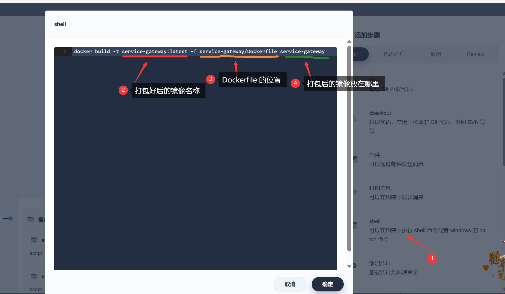
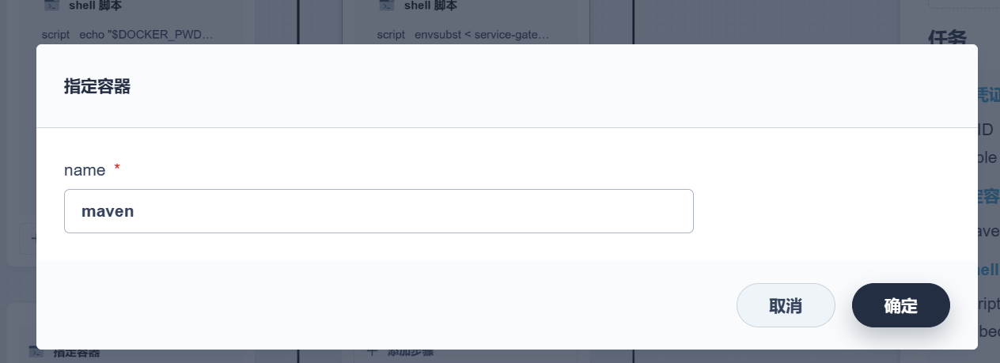

# kubesphere 3.3 流水线 部署java微服务项目


# 中间部署nacos：


## 1、将镜像上传至 仓库 

 **注意 此步骤是 将镜像上传到自己的私有仓库  此步骤可以跳过**

在可以访问 docker hub的服务器上拉取 镜像

```
docker pull --platform linux/arm64 nacos/nacos-server:v2.2.3-slim
```


登录 阿里云

```
docker login --username=aliyun4295435681 registry.cn-hangzhou.aliyuncs.com
```


标记镜像

```
docker tag 3218b38490ce registry.cn-hangzhou.aliyuncs.com/kubesphere-xu/kubesphere-xu:nacos-arm
```

上传镜像

```
docker push registry.cn-hangzhou.aliyuncs.com/kubesphere-xu/kubesphere-xu:nacos-arm
```


## 2、创建nacos的配置文件：

1. 创建 nacos-conf

2. 添加第一个配置文件

   1. 键：

      ```
      application.properties
      ```

   2. value

      ```bash
      #
      # Copyright 1999-2018 Alibaba Group Holding Ltd.
      #
      # Licensed under the Apache License, Version 2.0 (the "License");
      # you may not use this file except in compliance with the License.
      # You may obtain a copy of the License at
      #
      #      http://www.apache.org/licenses/LICENSE-2.0
      #
      # Unless required by applicable law or agreed to in writing, software
      # distributed under the License is distributed on an "AS IS" BASIS,
      # WITHOUT WARRANTIES OR CONDITIONS OF ANY KIND, either express or implied.
      # See the License for the specific language governing permissions and
      # limitations under the License.
      #
      
      #*************** Spring Boot Related Configurations ***************#
      ### Default web context path:
      server.servlet.contextPath=/nacos
      ### Default web server port:
      server.port=8848
      
      #*************** Network Related Configurations ***************#
      ### If prefer hostname over ip for Nacos server addresses in cluster.conf:
      # nacos.inetutils.prefer-hostname-over-ip=false
      
      ### Specify local server's IP:
      # nacos.inetutils.ip-address=
      
      
      #*************** Config Module Related Configurations ***************#
      ### If use MySQL as datasource:
      spring.datasource.platform=mysql
      
      ### Count of DB:
      db.num=1
      
      ### Connect URL of DB:
      db.url.0=jdbc:mysql://localhost:3306/nacos?characterEncoding=utf8&connectTimeout=1000&socketTimeout=3000&autoReconnect=true&useUnicode=true&useSSL=false&serverTimezone=GMT%2B8
      db.user.0=root
      db.password.0=123456
      
      ### Connection pool configuration: hikariCP
      db.pool.config.connectionTimeout=30000
      db.pool.config.validationTimeout=10000
      db.pool.config.maximumPoolSize=20
      db.pool.config.minimumIdle=2
      
      #*************** Naming Module Related Configurations ***************#
      ### Data dispatch task execution period in milliseconds:
      # nacos.naming.distro.taskDispatchPeriod=200
      
      ### Data count of batch sync task:
      # nacos.naming.distro.batchSyncKeyCount=1000
      
      ### Retry delay in milliseconds if sync task failed:
      # nacos.naming.distro.syncRetryDelay=5000
      
      ### If enable data warmup. If set to false, the server would accept request without local data preparation:
      # nacos.naming.data.warmup=true
      
      ### If enable the instance auto expiration, kind like of health check of instance:
      # nacos.naming.expireInstance=true
      
      nacos.naming.empty-service.auto-clean=true
      nacos.naming.empty-service.clean.initial-delay-ms=50000
      nacos.naming.empty-service.clean.period-time-ms=30000
      
      
      #*************** CMDB Module Related Configurations ***************#
      ### The interval to dump external CMDB in seconds:
      # nacos.cmdb.dumpTaskInterval=3600
      
      ### The interval of polling data change event in seconds:
      # nacos.cmdb.eventTaskInterval=10
      
      ### The interval of loading labels in seconds:
      # nacos.cmdb.labelTaskInterval=300
      
      ### If turn on data loading task:
      # nacos.cmdb.loadDataAtStart=false
      
      
      #*************** Metrics Related Configurations ***************#
      ### Metrics for prometheus
      #management.endpoints.web.exposure.include=*
      
      ### Metrics for elastic search
      management.metrics.export.elastic.enabled=false
      #management.metrics.export.elastic.host=http://localhost:9200
      
      ### Metrics for influx
      management.metrics.export.influx.enabled=false
      #management.metrics.export.influx.db=springboot
      #management.metrics.export.influx.uri=http://localhost:8086
      #management.metrics.export.influx.auto-create-db=true
      #management.metrics.export.influx.consistency=one
      #management.metrics.export.influx.compressed=true
      
      
      #*************** Access Log Related Configurations ***************#
      ### If turn on the access log:
      server.tomcat.accesslog.enabled=true
      
      ### The access log pattern:
      server.tomcat.accesslog.pattern=%h %l %u %t "%r" %s %b %D %{User-Agent}i %{Request-Source}i
      
      ### The directory of access log:
      server.tomcat.basedir=file:.
      
      
      #*************** Access Control Related Configurations ***************#
      ### If enable spring security, this option is deprecated in 1.2.0:
      #spring.security.enabled=false
      
      ### The ignore urls of auth, is deprecated in 1.2.0:
      nacos.security.ignore.urls=/,/error,/**/*.css,/**/*.js,/**/*.html,/**/*.map,/**/*.svg,/**/*.png,/**/*.ico,/console-ui/public/**,/v1/auth/**,/v1/console/health/**,/actuator/**,/v1/console/server/**
      
      ### The auth system to use, currently only 'nacos' is supported:
      nacos.core.auth.system.type=nacos
      
      ### If turn on auth system:
      nacos.core.auth.enabled=false
      
      ### The token expiration in seconds:
      nacos.core.auth.default.token.expire.seconds=18000
      
      ### The default token:
      nacos.core.auth.default.token.secret.key=SecretKey012345678901234567890123456789012345678901234567890123456789
      
      ### Turn on/off caching of auth information. By turning on this switch, the update of auth information would have a 15 seconds delay.
      nacos.core.auth.caching.enabled=true
      
      ### Since 1.4.1, Turn on/off white auth for user-agent: nacos-server, only for upgrade from old version.
      nacos.core.auth.enable.userAgentAuthWhite=true
      
      ### Since 1.4.1, worked when nacos.core.auth.enabled=true and nacos.core.auth.enable.userAgentAuthWhite=false.
      ### The two properties is the white list for auth and used by identity the request from other server.
      nacos.core.auth.server.identity.key=
      nacos.core.auth.server.identity.value=
      
      #*************** Istio Related Configurations ***************#
      ### If turn on the MCP server:
      nacos.istio.mcp.server.enabled=false
      
      
      
      ###*************** Add from 1.3.0 ***************###
      
      
      #*************** Core Related Configurations ***************#
      
      ### set the WorkerID manually
      # nacos.core.snowflake.worker-id=
      
      ### Member-MetaData
      # nacos.core.member.meta.site=
      # nacos.core.member.meta.adweight=
      # nacos.core.member.meta.weight=
      
      ### MemberLookup
      ### Addressing pattern category, If set, the priority is highest
      # nacos.core.member.lookup.type=[file,address-server]
      ## Set the cluster list with a configuration file or command-line argument
      # nacos.member.list=192.168.16.101:8847?raft_port=8807,192.168.16.101?raft_port=8808,192.168.16.101:8849?raft_port=8809
      ## for AddressServerMemberLookup
      # Maximum number of retries to query the address server upon initialization
      # nacos.core.address-server.retry=5
      ## Server domain name address of [address-server] mode
      # address.server.domain=jmenv.tbsite.net
      ## Server port of [address-server] mode
      # address.server.port=8080
      ## Request address of [address-server] mode
      # address.server.url=/nacos/serverlist
      
      #*************** JRaft Related Configurations ***************#
      
      ### Sets the Raft cluster election timeout, default value is 5 second
      # nacos.core.protocol.raft.data.election_timeout_ms=5000
      ### Sets the amount of time the Raft snapshot will execute periodically, default is 30 minute
      # nacos.core.protocol.raft.data.snapshot_interval_secs=30
      ### raft internal worker threads
      # nacos.core.protocol.raft.data.core_thread_num=8
      ### Number of threads required for raft business request processing
      # nacos.core.protocol.raft.data.cli_service_thread_num=4
      ### raft linear read strategy. Safe linear reads are used by default, that is, the Leader tenure is confirmed by heartbeat
      # nacos.core.protocol.raft.data.read_index_type=ReadOnlySafe
      ### rpc request timeout, default 5 seconds
      # nacos.core.protocol.raft.data.rpc_request_timeout_ms=5000
      
      ```

3. 配置第二个键值

   1. 键

      ```
      cluster.conf
      ```

   2. 值

      ```bash
      #
      # Copyright 1999-2018 Alibaba Group Holding Ltd.
      #
      # Licensed under the Apache License, Version 2.0 (the "License");
      # you may not use this file except in compliance with the License.
      # You may obtain a copy of the License at
      #
      #      http://www.apache.org/licenses/LICENSE-2.0
      #
      # Unless required by applicable law or agreed to in writing, software
      # distributed under the License is distributed on an "AS IS" BASIS,
      # WITHOUT WARRANTIES OR CONDITIONS OF ANY KIND, either express or implied.
      # See the License for the specific language governing permissions and
      # limitations under the License.
      #
      
      #it is ip
      #example
      nacos-v1-0.nacos.middleware.svc.cluster.local:8848
      nacos-v1-1.nacos.middleware.svc.cluster.local:8848
      nacos-v1-2.nacos.middleware.svc.cluster.local:8848
      ```

4. 注意这个配置是根据你的 先穿件nacos 之后 使用终端ping 域名的返回 

5. 

   

## 3、部署nacos

1. 使用默认端口  这里使用的镜像是从 我自己的私有仓库拉取

2. 同步主机时区

3. 没有挂载存储 配置挂载配置

   1. 挂载第一个配置文件 

      1. 

         ```
         /home/nacos/conf/application.properties
         ```

         

      2. 指定特定键

   2. 挂载第二个配置文件

      1. 

      2. 

         ```
         /home/nacos/conf/cluster.conf
         ```

         

      3. 指定特定键


**指定外网访问 哦 最后**


# 部署项目

**注意在附录中有 jenkinsfile 文件 可以直接导入便是一条完美的流水线** 

## 1、项目准备：

项目地址： [demo-deployment-kubesphere: demo-deployment-kubesphere (gitee.com)](https://gitee.com/dachang-rolling-dog/demo-deployment-kubesphere)

本项目为 一个测试部署的 微服务demo

1. ​	包含了两个服务 和 一个 网关
2. 中间件  nacos


### 1.1、需要更改位置 ： 

#### 1.1.1 项目的yml 文件 

1. 主要修改 的就是 nacos 的地址   （注意这里有三个服务 demo1、demo2、gateway）
2. 当然 你也可以修改为内部访问域名

```yaml
spring:
  application:
    name: service-demo1
  cloud:
    nacos:
      discovery:
        server-addr: 10.13.167.16:32518
#        server-addr: localhost:8848

server:
  port: 8081

```


#### 1.1.2 DockerFile

1. 可以自行更改jdk
2. 端口可自行更改  （每个服务的容器都是映射为 8080）
3. nacos 地址  这里就是使用的就是内部DNS  可自定义 不实用可以替换为IP地址

```dockerfile
FROM openjdk:8-jdk
LABEL maintainer=yszhdhy


#启动自行加载   服务名-prod.yml配置
ENV PARAMS="--server.port=8080 --spring.profiles.active=prod --spring.cloud.nacos.server-addr=nacos.middleware:8848 --spring.cloud.nacos.config.file-extension=yml"
RUN /bin/cp /usr/share/zoneinfo/Asia/Shanghai /etc/localtime && echo 'Asia/Shanghai' >/etc/timezone

COPY target/*.jar /app.jar
EXPOSE 8080


#
ENTRYPOINT ["/bin/sh","-c","java -Dfile.encoding=utf8 -Djava.security.egd=file:/dev/./urandom -jar /app.jar ${PARAMS}"]

```


#### 1.1.3 部署文件

1. 服务名称 需要更改为对应的项目名称 
2. 命名空间全部替换为 你自己kubesphere 中创建的项目的名称 

```js
apiVersion: apps/v1
kind: Deployment
metadata:
  labels:
    app: service-demo1
  name: service-demo1
  namespace: middleware   #一定要写名称空间o
spec:
  progressDeadlineSeconds: 600
  replicas: 1
  selector:
    matchLabels:
      app: service-demo1
  strategy:
    rollingUpdate:
      maxSurge: 50%
      maxUnavailable: 50%
    type: RollingUpdate
  template:
    metadata:
      labels:
        app: service-demo1
    spec:
      imagePullSecrets:
        - name: aliyun-docker-hub  #提前在项目下配置访问阿里云的账号密码
      containers:
        - image: $REGISTRY/$ALIYUNHUB_NAMESPACE/service-demo1:SNAPSHOT-$BUILD_NUMBER
 #         readinessProbe:
 #           httpGet:
 #             path: /actuator/health
 #             port: 8080
 #           timeoutSeconds: 10
 #           failureThreshold: 30
 #           periodSeconds: 5
          imagePullPolicy: Always
          name: app
          ports:
            - containerPort: 8080
              protocol: TCP
          resources:
            limits:
              cpu: 300m
              memory: 600Mi
          terminationMessagePath: /dev/termination-log
          terminationMessagePolicy: File
      dnsPolicy: ClusterFirst
      restartPolicy: Always
      terminationGracePeriodSeconds: 30
---
apiVersion: v1
kind: Service
metadata:
  labels:
    app: service-demo1
  name: service-demo1
  namespace: middleware
spec:
  ports:
    - name: http
      port: 8080
      protocol: TCP
      targetPort: 8080
  selector:
    app: service-demo1
  sessionAffinity: None
  type: ClusterIP

```


## 2、编辑流水线：

### 2.1 选择流水线大结构

1. 

### 2.2 第一步拉取代码

1. 
2. 指定容器
3. 添加嵌套步骤
   1. 选择 仓库 
   2. 查看 拉下来的项目
4. 之后先运行流水线
5. 成功结果

### 2.3 配置maven 镜像加速

1、修改maven让他从阿里云下载镜像

- 使用admin登陆ks

- 进入集群管理

- 进入配置中心

- 找到配置

- - [ks-devops-agent](http://139.198.165.238:30880/clusters/default/projects/kubesphere-devops-system/configmaps/ks-devops-agent)
  - 编辑配置
  - 修改这个配置。加入maven阿里云镜像加速地址

- ```bash
  <mirror>
      <id>nexus-aliyun</id>
      <name>Nexus aliyun</name>
      <url>http://maven.aliyun.com/nexus/content/groups/public/</url>
      <mirrorOf>central</mirrorOf>
  </mirror>
  ```

- 

### 2.3 项目编译

1. 更改第二步

2. 指定容器 maven

3. 嵌套步骤：

   1. 查看我们的代码

   2. 再次嵌套一个步骤

   3. 编译项目命令 `mavne打包`

      ```
      mvn clean package -Dmaven.test.skip=true
      ```

4. 运行流水线

   1. 运行
   2. 查看日志 成功结果


### 2.4 构建镜像

1. 编辑第三步 

2. 指定容器

3. 查看是否打包

4. 进行打包

   1. 编写打包命令 **（注意我们的项目中有编写好的 DockerFile）**

      ```
      docker build -t service-gateway:latest -f service-gateway/Dockerfile service-gateway
      ```

   2. 如果是微服务 可以指定并行执行  （也就是重复上面的动作 之后 指定其他的服务即可）

5. 运行流水线 测试第三步

6. 打包成功结果 

### 2.5 推送镜像到私有仓库

1. 编辑 

2. 在阿里云创建自己的仓库

3. 指定容器 还是 maven

4. 添加嵌套配置  配置阿里云 仓库凭证 

   1. 嵌套配置凭证
   2. 创建凭证  注意这里我们的凭证名称要和 jenkinsfile中的环境配置相同哦
   3. 配置变量 进行上传 docker镜像时会使用到

5. 执行推送镜像三部曲  **（也就是嵌套添加三个shell脚本）**

   ```js
                // 以下是三条命令
   
   script echo "$DOCKER_PWD_VAR" | docker login $REGISTRY -u "$DOCKER_USER_VAR" --password-stdin
   
   
                 script docker tag service-gateway:latest $REGISTRY/$DOCKERHUB_NAMESPACE/service-gateway:SNAPSHOT-$BUILD_NUMBER
   
   
                 script  docker push  $REGISTRY/$DOCKERHUB_NAMESPACE/service-gateway:SNAPSHOT-$BUILD_NUMBER
   ```

   


以上还有诸多配置  需要自己编写下Jenkins file  以上散步需要配置 仓库地址那些 需要在jenkinsfile中进行配置 

主要是增加 ：

```bash
 // 环境配置
  environment {
    DOCKER_CREDENTIAL_ID = 'dockerhub-id'
    GITHUB_CREDENTIAL_ID = 'github-id'
    KUBECONFIG_CREDENTIAL_ID = 'demo-kubeconfig'
    REGISTRY = 'registry.cn-hangzhou.aliyuncs.com' //阿里云地址
    DOCKERHUB_NAMESPACE = 'xu-hello' // 命名空间
    GITHUB_ACCOUNT = 'kubesphere'
    APP_NAME = 'devops-java-sample'
    ALIYUNHUB_NAMESPACE = 'xu-hello'
  }
  parameters {
    string(name: 'TAG_NAME', defaultValue: '', description: '')
  }
```

以下是执行到这步 的完整jenkinsfile

```js
pipeline {
  agent {
    node {
      label 'maven'
    }

  }
  stages {
    stage('拉取代码') {
      agent none
      steps {
        container('maven') {
          git(url: 'https://gitee.com/dachang-rolling-dog/demo-deployment-kubesphere.git', credentialsId: 'gitee-id', branch: 'master', changelog: true, poll: false)
          sh 'ls'
        }

      }
    }

    stage('项目编译') {
      agent none
      steps {
        container('maven') {
          sh 'ls'
          sh 'mvn clean package -Dmaven.test.skip=true'
        }

      }
    }

    stage('构建镜像') {
      parallel {
        stage('构建service-gateway镜像') {
          agent none
          steps {
            container('maven') {
              sh 'ls service-gateway/'
              sh 'docker build -t service-gateway:latest -f service-gateway/Dockerfile service-gateway'
              sh 'ls service-gateway/target'
            }

          }
        }

        stage('构建service-demo1镜像') {
          agent none
          steps {
            container('maven') {
              sh 'ls service/service-demo1/'
              sh 'docker build -t service-demo1:latest -f service/service-demo1/Dockerfile ./service/service-demo1'
              sh 'ls service/service-demo1/target'
            }

          }
        }

        stage('构建service-demo2镜像') {
          agent none
          steps {
            container('maven') {
              sh 'ls service/service-demo2/'
              sh 'docker build -t service-demo2:latest -f service/service-demo2/Dockerfile ./service/service-demo2'
              sh 'ls service/service-demo2/target'
            }

          }
        }

      }
    }

    stage('推送最新镜像') {
      parallel {
        stage('推送service-gateway镜像') {
          agent none
          steps {
            container('maven') {
              withCredentials([usernamePassword(credentialsId : 'aliyun-docker-registry' ,usernameVariable : 'DOCKER_USER_VAR' ,passwordVariable : 'DOCKER_PWD_VAR' ,)]) {
                sh 'echo "$DOCKER_PWD_VAR" | docker login $REGISTRY -u "$DOCKER_USER_VAR" --password-stdin'
                sh 'docker tag service-gateway:latest $REGISTRY/$DOCKERHUB_NAMESPACE/service-gateway:SNAPSHOT-$BUILD_NUMBER'
                sh 'docker push  $REGISTRY/$DOCKERHUB_NAMESPACE/service-gateway:SNAPSHOT-$BUILD_NUMBER'
              }

            }

          }
        }

        stage('dui ') {
          agent none
          steps {
            container('maven') {
              sh 'ls'
            }

          }
        }

      }
    }

    stage('Archive artifacts') {
      steps {
        archiveArtifacts 'target/*.jar'
      }
    }

  }
  // 环境配置
  environment {
    DOCKER_CREDENTIAL_ID = 'dockerhub-id'
    GITHUB_CREDENTIAL_ID = 'github-id'
    KUBECONFIG_CREDENTIAL_ID = 'demo-kubeconfig'
    REGISTRY = 'registry.cn-hangzhou.aliyuncs.com' //阿里云地址
    DOCKERHUB_NAMESPACE = 'xu-hello' // 命名空间
    GITHUB_ACCOUNT = 'kubesphere'
    APP_NAME = 'devops-java-sample'
    ALIYUNHUB_NAMESPACE = 'xu-hello'
  }
  parameters {
    string(name: 'TAG_NAME', defaultValue: '', description: '')
  }
}
```


### 2.6 部署服务：

1. 配置凭证
   1. 编辑凭证
   2. 指定 `KubeconfigFile Variable` 
2. 添加嵌套步骤
   1. 指定容器 还是maven
   2. 部署命令
3. 还要再配置 阿里云的账户凭证  名称为 我们的项目中  deploy 文件中`imagePullSecrets`
4. 编辑配置文件
   1. 使用admin登陆ks
   2. 进入集群管理
   3. 进入配置中心
   4. 
5. 之后在部署服务的项目中还要配置 一样的操作 （也就是在项目中再配置一遍）
6. 之后运行流水线即可 以下就是部署好的 三个项目 


以上就是一个 后端微服务 或者 单服务的流水线部署流程 还是十分简单的 ：

**当然如果你有编译好的jenkinsFile 可以直接拿来使用 哦**

1. 点击编辑JenkinsFile 

2. 之后将你的 文件复制进去即可 运行了。


## 附录：

1. 以下是本次部署项目的 jenkinsfile 文件 

   ```js
   pipeline {
     agent {
       node {
         label 'maven'
       }
   
     }
     stages {
       stage('拉取代码') {
         agent none
         steps {
           container('maven') {
             git(url: 'https://gitee.com/dachang-rolling-dog/demo-deployment-kubesphere.git', credentialsId: 'gitee-id', branch: 'master', changelog: true, poll: false)
             sh 'ls'
           }
   
         }
       }
   
       stage('项目编译') {
         agent none
         steps {
           container('maven') {
             sh 'ls'
             sh 'mvn clean package -Dmaven.test.skip=true'
           }
   
         }
       }
   
       stage('构建镜像') {
         parallel {
           stage('构建service-gateway镜像') {
             agent none
             steps {
               container('maven') {
                 sh 'ls service-gateway/'
                 sh 'docker build -t service-gateway:latest -f service-gateway/Dockerfile service-gateway'
                 sh 'ls service-gateway/target'
               }
   
             }
           }
   
           stage('构建service-demo1镜像') {
             agent none
             steps {
               container('maven') {
                 sh 'ls service/service-demo1/'
                 sh 'docker build -t service-demo1:latest -f service/service-demo1/Dockerfile ./service/service-demo1'
                 sh 'ls service/service-demo1/target'
               }
   
             }
           }
   
           stage('构建service-demo2镜像') {
             agent none
             steps {
               container('maven') {
                 sh 'ls service/service-demo2/'
                 sh 'docker build -t service-demo2:latest -f service/service-demo2/Dockerfile ./service/service-demo2'
                 sh 'ls service/service-demo2/target'
               }
   
             }
           }
   
         }
       }
   
       stage('推送最新镜像') {
         parallel {
           stage('推送service-gateway镜像') {
             agent none
             steps {
               container('maven') {
                 withCredentials([usernamePassword(credentialsId : 'aliyun-docker-registry' ,usernameVariable : 'DOCKER_USER_VAR' ,passwordVariable : 'DOCKER_PWD_VAR' ,)]) {
                   sh 'echo "$DOCKER_PWD_VAR" | docker login $REGISTRY -u "$DOCKER_USER_VAR" --password-stdin'
                   sh 'docker tag service-gateway:latest $REGISTRY/$DOCKERHUB_NAMESPACE/service-gateway:SNAPSHOT-$BUILD_NUMBER'
                   sh 'docker push  $REGISTRY/$DOCKERHUB_NAMESPACE/service-gateway:SNAPSHOT-$BUILD_NUMBER'
                 }
   
               }
   
             }
           }
   
           stage('推送service-demo1镜像') {
             agent none
             steps {
               container('maven') {
                 withCredentials([usernamePassword(credentialsId : 'aliyun-docker-registry' ,usernameVariable : 'DOCKER_USER_VAR' ,passwordVariable : 'DOCKER_PWD_VAR' ,)]) {
                   sh 'echo "$DOCKER_PWD_VAR" | docker login $REGISTRY -u "$DOCKER_USER_VAR" --password-stdin'
                   sh 'docker tag service-demo1:latest $REGISTRY/$DOCKERHUB_NAMESPACE/service-demo1:SNAPSHOT-$BUILD_NUMBER'
                   sh 'docker push  $REGISTRY/$DOCKERHUB_NAMESPACE/service-demo1:SNAPSHOT-$BUILD_NUMBER'
                 }
   
               }
   
             }
           }
   
           stage('推送service-demo2镜像') {
             agent none
             steps {
               container('maven') {
                 withCredentials([usernamePassword(credentialsId : 'aliyun-docker-registry' ,usernameVariable : 'DOCKER_USER_VAR' ,passwordVariable : 'DOCKER_PWD_VAR' ,)]) {
                   sh 'echo "$DOCKER_PWD_VAR" | docker login $REGISTRY -u "$DOCKER_USER_VAR" --password-stdin'
                   sh 'docker tag service-demo2:latest $REGISTRY/$DOCKERHUB_NAMESPACE/service-demo2:SNAPSHOT-$BUILD_NUMBER'
                   sh 'docker push  $REGISTRY/$DOCKERHUB_NAMESPACE/service-demo2:SNAPSHOT-$BUILD_NUMBER'
                 }
   
               }
   
             }
           }
   
         }
       }
   
       stage('部署到dev环境') {
         parallel {
           stage('server-gateway部署到dev环境') {
             steps {
               withCredentials([kubeconfigFile(credentialsId : 'demo-kubeconfig' ,variable : 'KUBECONFIG' )]) {
                 container('maven') {
                   sh 'envsubst < service-gateway/deploy/deploy.yml | kubectl apply -f -'
                 }
   
               }
   
             }
           }
   
           stage('service-demo1部署到dev环境') {
             steps {
               withCredentials([kubeconfigFile(credentialsId : 'demo-kubeconfig' ,variable : 'KUBECONFIG' )]) {
                 container('maven') {
                   sh 'envsubst < service/service-demo1/deploy/deploy.yml | kubectl apply -f -'
                 }
   
               }
   
             }
           }
   
           stage('service-demo2部署到dev环境') {
             steps {
               withCredentials([kubeconfigFile(credentialsId : 'demo-kubeconfig' ,variable : 'KUBECONFIG' )]) {
                 container('maven') {
                   sh 'envsubst < service/service-demo2/deploy/deploy.yml | kubectl apply -f -'
                 }
   
               }
   
             }
           }
   
         }
       }
   
     }
       
       // 以下打了注释的 地方需要自定义配置 其余地方不变
     environment {
       DOCKER_CREDENTIAL_ID = 'dockerhub-id'
       GITHUB_CREDENTIAL_ID = 'github-id'
         
       KUBECONFIG_CREDENTIAL_ID = 'demo-kubeconfig'  // 这里是我们在 部署环节中所配置 环境变量 等信息  关于 .kube 的  （这里没有使用到 因为kubesphere:3.2 之后就被弃用了部署的命令 所以这里换了部署的命令也就自然没有用到）
       REGISTRY = 'registry.cn-hangzhou.aliyuncs.com' // 阿里云仓库地址
       DOCKERHUB_NAMESPACE = 'xu-hello'  // 我的阿里云 命名空间的名称
       GITHUB_ACCOUNT = 'kubesphere'
       APP_NAME = 'devops-java-sample' 
       ALIYUNHUB_NAMESPACE = 'xu-hello'   // 我的阿里云 命名空间的名称
     }
     parameters {
       string(name: 'TAG_NAME', defaultValue: '', description: '')
     }
   }
   ```


