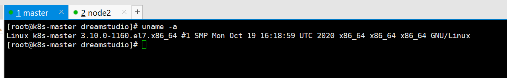

# 鲲鹏920 arm + x86 架构混合搭建k8s集群并安装kubesphere

## 1、服务器准备：

### 1.1、 x86 服务器：

准备一台x86 服务器

我的环境：

1. cpu：16个
2. 内存 ：16G
3. 系统：centos8_x86
4. 

### 1.2 、 鲲鹏920 arm 服务器

准备一台就行（测试阶段，如果有多的可以继续加入）

我的环境：

1. cpu：64个
2. 内存：64G
3. 系统: centos8_arm
4. 


## 2、创建master节点：

**选择x86 服务器作为master节点**

### 2.1 环境配置：

```bash
# 将 SELinux 设置为 permissive 宽容模式（相当于将其禁用）
sudo setenforce 0
sudo sed -i 's/^SELINUX=enforcing$/SELINUX=permissive/' /etc/selinux/config

#关闭swap
swapoff -a  
sed -ri 's/.*swap.*/#&/' /etc/fstab

#允许 iptables 检查桥接流量
cat <<EOF | sudo tee /etc/modules-load.d/k8s.conf
br_netfilter
EOF

cat <<EOF | sudo tee /etc/sysctl.d/k8s.conf
net.bridge.bridge-nf-call-ip6tables = 1
net.bridge.bridge-nf-call-iptables = 1
EOF
sudo sysctl --system
```

**命令详解 请在附录中查看**


### **2.2 安装时间同步服务器**

```bash
yum install chrony -y
systemctl enable chronyd.service
systemctl start chronyd.service

//查看chrony状态
systemctl status chronyd.service chronyc sources
● chronyd.service - NTP client/server
   Loaded: loaded (/usr/lib/systemd/system/chronyd.service; enabled; vendor preset: enabled)
   Active: active (running) since Mon 2021-03-22 14:32:33 CST; 11min ago
     Docs: man:chronyd(8)
           man:chrony.conf(5)
 Main PID: 611 (chronyd)
   CGroup: /system.slice/chronyd.service
           └─611 /usr/sbin/chronyd

Mar 22 14:32:33 localhost systemd[1]: Starting NTP client/server...
Mar 22 14:32:33 localhost chronyd[611]: chronyd version 3.4 starting (+CMDMON +NTP +REFCLOCK +RTC +PRIVDROP +SCFILTER +SIGND +ASYNCDNS +... +DEBUG)
Mar 22 14:32:33 localhost chronyd[611]: Frequency -3.712 +/- 0.085 ppm read from /var/lib/chrony/drift
Mar 22 14:32:33 localhost systemd[1]: Started NTP client/server.
Mar 22 14:32:38 k8s-master chronyd[611]: Selected source 100.125.0.251
```

**命令详解 请在附录中查看**


### **2.3 设置 hostname ：**

```bash
#设置每个机器自己的hostname
hostnamectl set-hostname xxx

eg:
作为主节点的服务器设置为：  hostnamectl set-hostname k8s-master
其余两台工作服务器  
第一台 ：hostnamectl set-hostname node1
第一台 ：hostnamectl set-hostname node2
```

**配置master域名**

```bash
#所有机器配置master域名
echo "192.168.1.211  k8s-master" >> /etc/hosts   # 注意点： ip 改为master 的ip 也就是这台服务器的ip
```

**命令详解 请在附录中查看**

### 2.4  安装k8s 和kubesphere

使用kk 进行一键 安装

1. k

   ```
   export KKZONE=cn
   ```

   

2. 下载

   ```
   curl -sfL https://get-kk.kubesphere.io | VERSION=v3.0.7 sh -
   ```

3. 添加权限

   ```
   chmod +x kk
   ```

4. 安装网络工具和跟踪

   ```bash
   #可能需要下面命令
   yum install -y conntrack
   yum install -y socat
   ```

   **命令详解 请在附录中查看**

5. 同时安装kubernetes 和 kubesphere

   ```bash
   ./kk create cluster --with-kubernetes v1.22.12 --with-kubesphere v3.3.2
   
   ```

6. 监控

   ```bash
   kubectl logs -n kubesphere-system $(kubectl get pod -n kubesphere-system -l 'app in (ks-install, ks-installer)' -o jsonpath='{.items[0].metadata.name}') -f
   ```

7. 输出信息会显示 Web 控制台的 IP 地址和端口号，默认的 NodePort 是 `30880`。现在，您可以使用默认的帐户和密码 (`admin/P@88w0rd`) 通过 `<NodeIP>:30880` 访问控制台。

8. 这里就可以查看kubesphere了

9. 在执行安装的时候 会进行初始化，记录初始化的关键信息 向上翻找日志 找到初始化时的日志并记录下来 **注意:关键信息很重要，一定要记录下来后面加入node节点会使用到**

10. 关键信息：

   ```bash
   Your Kubernetes control-plane has initialized successfully!
   
   To start using your cluster, you need to run the following as a regular user:
   
     mkdir -p $HOME/.kube
     sudo cp -i /etc/kubernetes/admin.conf $HOME/.kube/config
     sudo chown $(id -u):$(id -g) $HOME/.kube/config
   
   Alternatively, if you are the root user, you can run:
   
     export KUBECONFIG=/etc/kubernetes/admin.conf
   
   You should now deploy a pod network to the cluster.
   Run "kubectl apply -f [podnetwork].yaml" with one of the options listed at:
     https://kubernetes.io/docs/concepts/cluster-administration/addons/
   
   You can now join any number of control-plane nodes by copying certificate authorities
   and service account keys on each node and then running the following as root:
   
     kubeadm join lb.kubesphere.local:6443 --token 4lsne7.5l5mqekc29gmlip5 \
   	--discovery-token-ca-cert-hash sha256:7a46660a11c92a03f4cc78d9775bc319536bc3eaaa74aca11a03799745fb628e \
   	--control-plane 
   
   Then you can join any number of worker nodes by running the following on each as root:
   
   kubeadm join lb.kubesphere.local:6443 --token 4lsne7.5l5mqekc29gmlip5 \
   	--discovery-token-ca-cert-hash sha256:7a46660a11c92a03f4cc78d9775bc319536bc3eaaa74aca11a03799745fb628e
   
   ```

11. 给master 打上污点：

    ```bash
    kubectl taint nodes k8s-master node-role.kubernetes.io=master:NoSchedule
    
    
    kubectl taint nodes print.dscloud.com node-role.kubernetes.io=master:NoSchedule
    #  k8s-master 是 master节点的名称  可以通过 kubectl get nodes 查看
    ```

    **命令详解 请在附录中查看**

12. 查看pod 健康状况，确保所有都运行


### 2.5 开启全功能：

1. 进入平台 
2. 点击编辑文件
3. 所有的false改为true


**开启全功能有什么作用：**


1. 应用管理：KubeSphere 具备应用生命周期管理的功能，你可以通过它轻松地创建、部署、更新和扩展应用程序。全功能模式下，你可以使用 Helm Charts 或者 KubeSphere 的应用商店来快速部署和管理应用。
2. 多租户支持：KubeSphere 具有多租户功能，可以将 Kubernetes 集群划分为多个租户，并为每个租户提供独立的命名空间和资源隔离。全功能模式下，你可以轻松地创建和管理租户，为不同的团队或项目提供独立的环境。
3. 监控与日志：KubeSphere 提供了丰富的监控和日志功能，可以帮助你实时监控集群和应用程序的健康状态、性能指标等。全功能模式下，你可以配置和查看监控指标、日志信息，并设置告警规则以及可视化报表等。
4. CI/CD 支持：KubeSphere 提供了集成的 CI/CD 功能，可以帮助你实现持续集成和持续部署。全功能模式下，你可以配置构建流水线、自动化测试和部署流程，简化应用程序的交付过程。


## 3、搭建node节点并加入集群

**node节点 则是arm架构的服务器**

### 3.1 环境搭建：

```bash
//关闭防火墙
systemctl stop firewalld
systemctl disable firewalld

//关闭selinux
sed -i 's/enforcing/disabled/' /etc/selinux/config
setenforce 0

//临时关闭 swap
swapoff -a

cat > /etc/sysctl.d/k8s.conf << EOF
net.bridge.bridge-nf-call-ip6tables = 1
net.bridge.bridge-nf-call-iptables = 1
EOF

sysctl --system
```

### 3.2 **安装时间同步服务器**

```bash
yum install chrony -y
systemctl enable chronyd.service
systemctl start chronyd.service

//查看chrony状态
systemctl status chronyd.service chronyc sources
● chronyd.service - NTP client/server
   Loaded: loaded (/usr/lib/systemd/system/chronyd.service; enabled; vendor preset: enabled)
   Active: active (running) since Mon 2021-03-22 14:32:33 CST; 11min ago
     Docs: man:chronyd(8)
           man:chrony.conf(5)
 Main PID: 611 (chronyd)
   CGroup: /system.slice/chronyd.service
           └─611 /usr/sbin/chronyd

Mar 22 14:32:33 localhost systemd[1]: Starting NTP client/server...
Mar 22 14:32:33 localhost chronyd[611]: chronyd version 3.4 starting (+CMDMON +NTP +REFCLOCK +RTC +PRIVDROP +SCFILTER +SIGND +ASYNCDNS +... +DEBUG)
Mar 22 14:32:33 localhost chronyd[611]: Frequency -3.712 +/- 0.085 ppm read from /var/lib/chrony/drift
Mar 22 14:32:33 localhost systemd[1]: Started NTP client/server.
Mar 22 14:32:38 k8s-master chronyd[611]: Selected source 100.125.0.251
```

### 3.3 **安装docker :**


```bash
sudo yum remove docker*
//配置repo
wget -O /etc/yum.repos.d/docker-ce.repo https://repo.huaweicloud.com/docker-ce/linux/centos/docker-ce.repo
sudo sed -i 's+download.docker.com+repo.huaweicloud.com/docker-ce+' /etc/yum.repos.d/docker-ce.repo
export releasever=7
export basearch=aarch64

//安装Docker-CE
sudo yum makecache
sudo yum -y install docker-ce-3:24.0.2-1.el8.aarch64 --allowerasing    # --allowerasing 表示允许安装新的替换旧的

//配置Docker-CE
systemctl start docker
systemctl enable docker.service
```

查询docker 版本 （如果执行上面的操作显示没有此版本的docker 就使用此命令查看）：

```
yum list docker-ce
```


### 3.4 **安装kubeadm等组件**

```bash
# 设置镜像源
cat <<EOF > /etc/yum.repos.d/kubernetes.repo
[kubernetes]
name=Kubernetes
baseurl=http://mirrors.aliyun.com/kubernetes/yum/repos/kubernetes-el7-aarch64
enabled=1
gpgcheck=0
repo_gpgcheck=0
gpgkey=http://mirrors.aliyun.com/kubernetes/yum/doc/yum-key.gpg
       http://mirrors.aliyun.com/kubernetes/yum/doc/rpm-package-key.gpg
EOF

# 安装
yum install -y kubelet-1.22.12 kubeadm-1.22.12 kubectl-1.22.12 --disableexcludes=kubernetes 

#启动
systemctl enable kubelet
systemctl start kubelet --now
```

### 3.5 **设置 hostname ：**

```bash
#设置每个机器自己的hostname
hostnamectl set-hostname xxx

eg:
作为主节点的服务器设置为：  hostnamectl set-hostname k8s-master
其余两台工作服务器  
第一台 ：hostnamectl set-hostname node2
```

**配置master域名**

```bash
#所有机器配置master域名
echo "192.168.1.211  k8s-master" >> /etc/hosts   # 注意点： ip 改为master 的ip

echo "192.168.1.211  lb.kubesphere.local" >> /etc/hosts
```

### 3.6 加入集群


**遇到问题**（其他警告可以置之不理，但是涉及到网络插件的必须解决 ） 提前解决：

**问题一：**

注意点：在其他节点也要执行 （比如加入work节点时要进行查看）

```bash
问题：
[WARNING FileExisting-tc]: tc not found in system path

解决方法 ：
dnf install -y iproute-tc
```

**命令详解 请在附录中查看**


**问题二： 配置docker 驱动**

Warning：detected "cgroupfs" as the Docker cgroup driver. The recommended driver is "systemd".

[警告IsDockerSystemdCheck]：检测到“cgroupfs”作为Docker cgroup驱动程序。 推荐的驱动程序是“systemd”。

所以我们更换一下驱动。

**解决方法：修改docker**

在/etc/docker下创建daemon.json并编辑：

```
vi /etc/docker/daemon.json
```

加入以下内容：

```csharp
{
 "exec-opts":["native.cgroupdriver=systemd"]
}
```


重启docker

```bash
systemctl restart docker
systemctl status docker
```


**加入集群：**

此信息来自于 master 记录的详细信息中 **（root 权限，可以加入任意多的节点）**

```bash
kubeadm join k8s-master:6443 --token kuejzu.lqngs1rgb7ji85c7 \
	--discovery-token-ca-cert-hash sha256:33f5b77d993aa028509dcb88239562f08c6eb98bd50e9764563ee972008f5b8b


kubeadm join lb.kubesphere.local:6443 --token 4lsne7.5l5mqekc29gmlip5 \
	--discovery-token-ca-cert-hash sha256:7a46660a11c92a03f4cc78d9775bc319536bc3eaaa74aca11a03799745fb628e
```

查看pod 状况

```bash
kubectl get pod -A -o wide
```


在kubesphere 上查看情况


**部署一个服务 mysql （注意要使用arm 架构的镜像）**


# 附录：

## 命令详解集：

### 1、环境配置：

```bash
# 将 SELinux 设置为 permissive 宽容模式（相当于将其禁用）
sudo setenforce 0
sudo sed -i 's/^SELINUX=enforcing$/SELINUX=permissive/' /etc/selinux/config

#关闭swap
swapoff -a  
sed -ri 's/.*swap.*/#&/' /etc/fstab

#允许 iptables 检查桥接流量
cat <<EOF | sudo tee /etc/modules-load.d/k8s.conf
br_netfilter
EOF

cat <<EOF | sudo tee /etc/sysctl.d/k8s.conf
net.bridge.bridge-nf-call-ip6tables = 1
net.bridge.bridge-nf-call-iptables = 1
EOF
sudo sysctl --system
```

解释：

1. `sudo setenforce 0`：
   - 作用：此命令用于临时禁用 SELinux（Security-Enhanced Linux）的强制模式。
   - 解释：SELinux 是一种安全模块，用于在 Linux 操作系统上实施强制访问控制。`setenforce` 命令用于更改 SELinux 的强制模式状态。通过将其设置为 0，也就是"Permissive"（宽容模式），SELinux 会记录违规行为，但不会阻止它们。
2. `sudo sed -i 's/^SELINUX=enforcing$/SELINUX=permissive/' /etc/selinux/config`：
   - 作用：此命令用于修改 `/etc/selinux/config` 文件中的 SELinux 配置。
   - 解释：`sed` 是一个文本处理工具，而这个命令使用 `sed` 对 `/etc/selinux/config` 文件进行编辑。`-i` 选项指示 `sed` 在原始文件中进行直接编辑，而不是输出到标准输出。正则表达式 `s/^SELINUX=enforcing$/SELINUX=permissive/` 用于搜索以 `SELINUX=enforcing` 开头的行，并将其替换为 `SELINUX=permissive`。这将把 SELinux 的强制模式从 "Enforcing"（强制模式）修改为 "Permissive"（宽容模式）。修改后的配置将在系统重新启动后生效。
3. 关闭 swap：
   - 命令：`swapoff -a`
   - 作用：此命令用于关闭系统中的 swap 分区。
   - 解释：Swap 是一种用于在物理内存不足时将数据转存到磁盘的机制。在 Kubernetes 集群中，建议禁用 swap，因为 swap 对于容器化应用来说可能会导致性能下降。通过执行 `swapoff -a` 命令，系统将关闭所有的 swap 分区。
4. 注释掉 swap 分区：
   - 命令：`sed -ri 's/.*swap.*/#&/' /etc/fstab`
   - 作用：此命令用于在 `/etc/fstab` 文件中注释掉 swap 分区的相关行。
   - 解释：`/etc/fstab` 是一个用于存储文件系统挂载信息的文件。通过执行上述命令，它会使用正则表达式将 `/etc/fstab` 文件中包含 "swap" 的行注释掉，从而禁用了系统的 swap 分区。
5. 允许 iptables 检查桥接流量：
   - 命令：`cat <<EOF | sudo tee /etc/modules-load.d/k8s.conf br_netfilter EOF`
   - 作用：此命令用于创建并编辑 `/etc/modules-load.d/k8s.conf` 文件，以加载 `br_netfilter` 模块。
   - 解释：Kubernetes 集群中使用桥接网络（bridge network），`br_netfilter` 模块对于 iptables 在桥接流量上进行检查是必需的。通过执行上述命令，将 `br_netfilter` 添加到 `/etc/modules-load.d/k8s.conf` 文件中，以确保在系统启动时加载该模块。
6. 设置网络参数：
   - 命令：`cat <<EOF | sudo tee /etc/sysctl.d/k8s.conf net.bridge.bridge-nf-call-ip6tables = 1 net.bridge.bridge-nf-call-iptables = 1 EOF sudo sysctl --system`
   - 作用：此命令用于创建并编辑 `/etc/sysctl.d/k8s.conf` 文件，设置网络参数，并通过 `sysctl --system` 命令使其生效。
   - 解释：Kubernetes 需要特定的网络参数配置。上述命令将 `net.bridge.bridge-nf-call-ip6tables` 和 `net.bridge.bridge-nf-call-iptables` 设置为 1，以确保 Linux 桥接网络能够正确工作。通过执行 `sudo sysctl --system`，使配置的网络参数在系统重新启动后生效。


### **2、安装时间同步器**

```
yum install chrony -y
systemctl enable chronyd.service
systemctl start chronyd.service
```

1. 安装 Chrony：
   - 命令：`yum install chrony -y`
   - 作用：此命令使用 yum 包管理器在系统上安装 Chrony 时间同步服务。
   - 解释：Chrony 是一个网络时间协议 (NTP) 客户端和服务器，用于在计算机系统之间同步时间。通过执行上述命令，会使用 yum 安装 Chrony 包并自动解决其依赖项。
2. 启用 Chrony 服务：
   - 命令：`systemctl enable chronyd.service`
   - 作用：此命令用于在系统启动时启用 Chrony 服务。
   - 解释：`systemctl enable` 命令用于设置服务在系统启动时自动启用。通过执行上述命令，Chrony 服务将在系统启动时自动启动。
3. 启动 Chrony 服务：
   - 命令：`systemctl start chronyd.service`
   - 作用：此命令用于启动 Chrony 服务。
   - 解释：`systemctl start` 命令用于启动指定的服务。通过执行上述命令，Chrony 服务将立即启动并开始同步系统时间。

请注意，Chrony 服务的安装和启动是为了确保系统中的时间同步，这在分布式系统和集群中特别重要。

**作用：**

1. 一致性和协调：在分布式系统中，不同的计算节点或服务器之间需要相互协调和通信。如果节点的时间不同步，可能导致数据不一致、操作冲突以及其他协调问题。通过时间同步，可以确保各个节点上的时钟保持一致，从而提供一致的视图和行为。
2. 计算和日志的一致性：许多分布式系统和应用程序依赖于时间戳来进行计算、排序和记录事件。如果不同节点的时间不同步，可能导致计算错误、事件顺序混乱或日志不准确。通过时间同步，可以确保这些操作的一致性和准确性。
3. 安全和认证：许多安全协议和机制依赖于时间来验证和认证事件的顺序和时间戳。例如，证书的有效期限、身份验证令牌的时效性等。如果时间不同步，这些安全机制可能会受到威胁或无效。通过时间同步，可以确保安全协议和认证机制的正确运行。
4. 故障排除和日志分析：当系统发生故障或问题时，时间戳在故障排除和日志分析中起着关键作用。通过时间同步，可以确保事件的时间戳是准确的，从而帮助定位和解决问题


### 3、**设置 hostname** 

```
hostnamectl set-hostname k8s-master
```

- `hostnamectl` 是一个命令行工具，用于管理主机名和相关的系统设置。
- `set-hostname` 是 `hostnamectl` 的一个子命令，用于设置主机名。
- `k8s-master` 是您希望设置的新主机名。

通过执行该命令，系统的主机名将被更改为 "k8s-master"。请注意，更改主机名可能需要重新启动系统才能生效。主机名对于网络通信和标识主机在集群中的角色非常重要，因此设置有意义和易于识别的主机名可以提高系统管理和维护的效率。


**配置master域名**

```bash
#所有机器配置master域名
echo "10.13.166.115  k8s-master" >> /etc/hosts   # 注意点： ip 改为master 的ip 也就是这台服务器的ip
```

- `echo` 是一个命令行工具，用于输出文本内容。
- `"10.13.166.115 k8s-master"` 是您要添加的 IP 地址和主机名的映射。
- `>> /etc/hosts` 将输出的内容追加到 `/etc/hosts` 文件中。

通过执行该命令，将 IP 地址 "10.13.166.115" 和主机名 "k8s-master" 添加到 `/etc/hosts` 文件的末尾。这样做的目的是在本地主机上建立 IP 地址与主机名的映射关系，以便在网络通信时能够使用主机名进行访问。

请注意，将正确的 IP 地址与主机名映射到 `/etc/hosts` 文件对于主机之间的通信和名称解析非常重要。确保将实际的 IP 地址替换为 "10.13.166.115"，以与您的环境相匹配。


### 4、安装网络工具和跟踪

```
#可能需要下面命令
yum install -y conntrack
yum install -y socat
```


1. 安装 Conntrack：
   - 命令：`yum install -y conntrack`
   - 作用：该命令使用 yum 包管理器在系统上安装 Conntrack。
   - 解释：Conntrack 是一个连接追踪工具，用于跟踪网络连接和状态。在 Kubernetes 集群中，Conntrack 用于管理和跟踪网络连接，以确保网络流量的正确路由和传递。通过执行上述命令，将使用 yum 安装 Conntrack 包并自动解决其依赖项。
2. 安装 Socat：
   - 命令：`yum install -y socat`
   - 作用：该命令使用 yum 包管理器在系统上安装 Socat。
   - 解释：Socat 是一个多功能的网络工具，用于在不同的网络层之间建立连接和传输数据。在 Kubernetes 集群中，Socat 可能用于代理、转发和调试网络流量。通过执行上述命令，将使用 yum 安装 Socat 包并自动解决其依赖项。

这两个工具在 Kubernetes 集群的安装和运行中扮演重要的角色，确保网络连接的正确性和稳定性。安装它们可以满足集群的依赖要求，并提供所需的网络功能。


### 5、给master 打上污点：

```bash
kubectl taint nodes k8s-master node-role.kubernetes.io=master:NoSchedule

#  k8s-master 是 master节点的名称  可以通过 kubectl get nodes查看
```

- `kubectl` 是 Kubernetes 的命令行工具，用于与 Kubernetes 集群进行交互。

- `taint` 是 `kubectl` 的一个子命令，用于向节点添加或移除 Taint。

- `nodes k8s-master` 表示目标节点的名称为 "k8s-master"。

- ```
  node-role.kubernetes.io=master:NoSchedule
  ```

   是要添加的 Taint 的键值对表示形式。

  - `node-role.kubernetes.io=master` 表示 Taint 的键为 "node-role.kubernetes.io"，值为 "master"。
  - `NoSchedule` 是 Taint 的效果，它将阻止调度器在节点上运行不符合 Taint 要求的 Pod。

通过执行该命令，将在名为 "k8s-master" 的节点上添加一个 Taint，表示该节点是一个主节点（master）并且不会被调度器用于运行不符合 Taint 要求的 Pod。这样做的目的是确保主节点不会负载过重，并保持其用于运行系统关键组件的能力。

请注意，在执行该命令之前，请确保您具有足够的权限和对目标节点的管理访问权限。


### 6、问题解决：

```
dnf install -y iproute-tc
```


- `dnf` 是在基于 Fedora、CentOS 和 RHEL (Red Hat Enterprise Linux) 等系统上使用的包管理器。
- `install -y` 是 `dnf` 的子命令和选项，用于安装软件包并自动确认所有提示。
- `iproute-tc` 是要安装的软件包的名称。

通过执行该命令，将使用 DNF 安装名为 `iproute-tc` 的软件包。`iproute-tc` 是用于配置和管理网络路由和流量控制的工具。它提供了丰富的网络管理功能，包括设置路由规则、配置网络接口和控制流量等。

请注意，该命令可能需要在具有适当权限的用户或管理员权限下执行。


## 加入新master：


# 多租户实战：


## 1、创建用户：

1. 进入kubesphere管理平台：
2. 创建用户：
3. 填写用户信息并创建
   1. 三种角色 所包含的权限
4. 


# 中间件部署实战：

## 1、部署mysql

### 1.1创建配置文件：

1. 进入到项目中 创建配置

2. 书写配置名称 随意且规范

3. 点击配置键值对后 配置以下内容 

   1. 键：

      ```
      my.cnf
      ```

   2. 值

      ```bash
      [client]
      default-character-set=utf8mb4
       
      [mysql]
      default-character-set=utf8mb4
       
      [mysqld]
      init_connect='SET collation_connection = utf8mb4_unicode_ci'
      init_connect='SET NAMES utf8mb4'
      character-set-server=utf8mb4
      collation-server=utf8mb4_unicode_ci
      skip-character-set-client-handshake
      skip-name-resolve
      ```

   3. 


### 1.2 创建服务

1. 之后来到上面创建服务
2. 选择有状态服务
3. 填写服务名称
4. 


# 交换机 升级：

TFTP（Trivial File Transfer Protocol,简单文件传输协议）是基于UDP协议实现的一个用来在客户机与服务器之间进行简单文件传输的协议，提供不复杂、开销不大的文件传输服务。

TFTP设计的时候是进行小文件传输的。因此它不具备通常的FTP的许多功能，它只能从文件服务器上获得或写入文件，不能列出目录，不进行认证，它传输8位数据。传输中常用两种模式：netascii，这是8位的ASCII码形式，另一种是octet，这是8位源数据类型；默认使用端口号为69。

下面介绍如何在Windows下和Linux（Ubuntu）下安装和使用TFTP工具

 

一、Windows下载和安装TFTP 服务器和客户端工具

tftp32(tftp64)是Windows使用较广的一个TFTP工具，同时支持服务器和客户端模式，以下是tftp32的官方网站地址http://tftpd32.jounin.net/ ，在官方下载需要的版本，双击按照提示一步步安装即可。

打来tftp32/tftp64 工具，选择正下方的Settings按钮


在弹出的对话框中选择GLOBAL自对话框，选择自己需要的服务和客户端类型。这里选择了 TFTP Server 和 TFTP Client两项


切换到 TFTP子对话框，这里可以设置一些TFTP的参数包括TFTP默认工作目录，以及端口等，端口默认为69，不建议随便修改。


## 1、使用xshell 连接交换机：

1.  准备一个 USB转串口的线连接交换机和电脑
2. 打开xshell 进行连接
   1. 
   2. 
3. 在交换机重启后 快速交替按下 ctrl+B，输入密码 默认密码是 ` Admin@huawei.com` 进入 管理页面


## 2、 传输系统文件cc 到交换机中

1. 选择3 以太网传输：
2. 选择2 进行设置
3. 在 执行以下步骤时：首先 需要使用网线在交换机和电脑之间建立连接
   1. 交换机网线接口 `接在交换机的eth网口` ：
4. 确保在同一个网段
5. **选择1** TFTP传输 并设置 ip
6. 设置好后 按4 回退
7. 在自己的电脑上安装 TFTP文件服务器
   1. 以下是tftp32的官方网站地址http://tftpd32.jounin.net/ ，在官方下载需要的版本，双击按照提示一步步安装即可。
   2. 安装好的界面
   3. 不用进行更改就默认选择
   4. `C:\Users\ACER\Desktop\S5713-H` 指向我们存放cc文件的文件夹
8. 关闭电脑的防火墙
9. 之后再选择1  等待传输完成即可


## 3、配置启动文件：

1. 返回到 主菜单界面
2.  按下2  进入启动子菜单
3. 按下2 进行修改配置
4. 按下 3  返回主菜单 
5. 按下 7  重启即可
6. 注意点： 期间可能会重启多次 尽量不要打断避免造成更大的错误


## 4、图形化界面

1. 此系统自带一个图形化界面
2. 使用一根网线连通交换机和主机 `网线接入交换机 eth 网口`  设置电脑以太网网段 使之可以相互通信即可
3. 在电脑的浏览器输入 交换机的默认ip 回车即可到登录界面


### 2、添加一个新用户

\# 以用户名为**admin123**，新密码为**Example@123**为例，配置如下。

```bash
<Switch> system-view
[Switch] aaa
[Switch-aaa] local-user admin123 password irreversible-cipher Example@123
[Switch-aaa] local-user admin123 service-type http
[Switch-aaa] local-user admin123 privilege level 15 # 设置等级 
[Switch-aaa] return
<Switch> save
```


登录即可完成：  用户名 `admin` 密码：`Guowushi@123`


