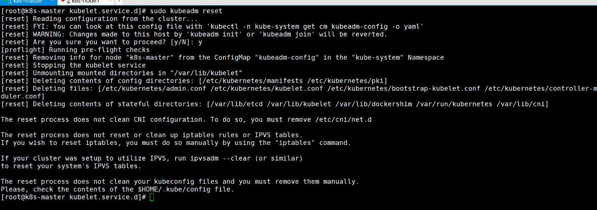
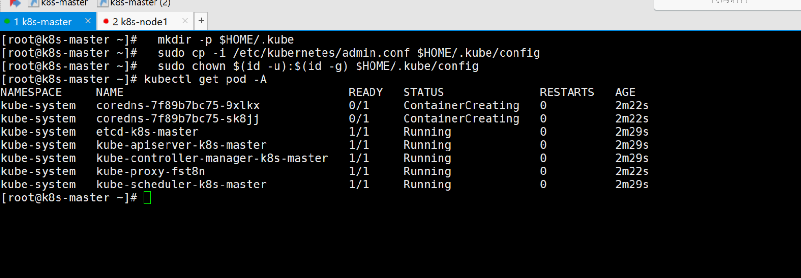
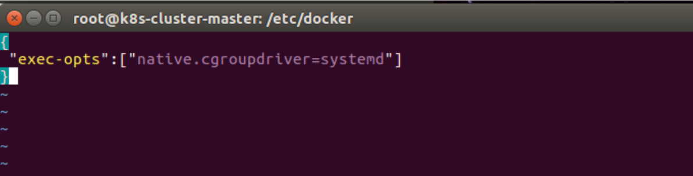
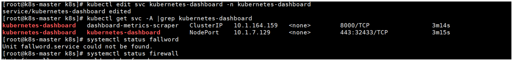
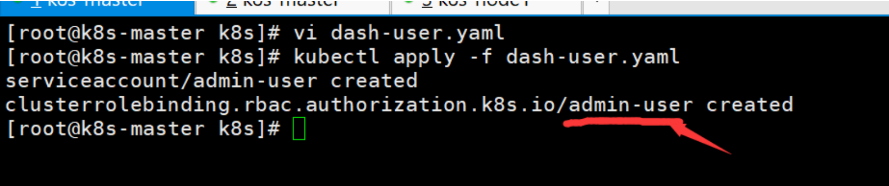
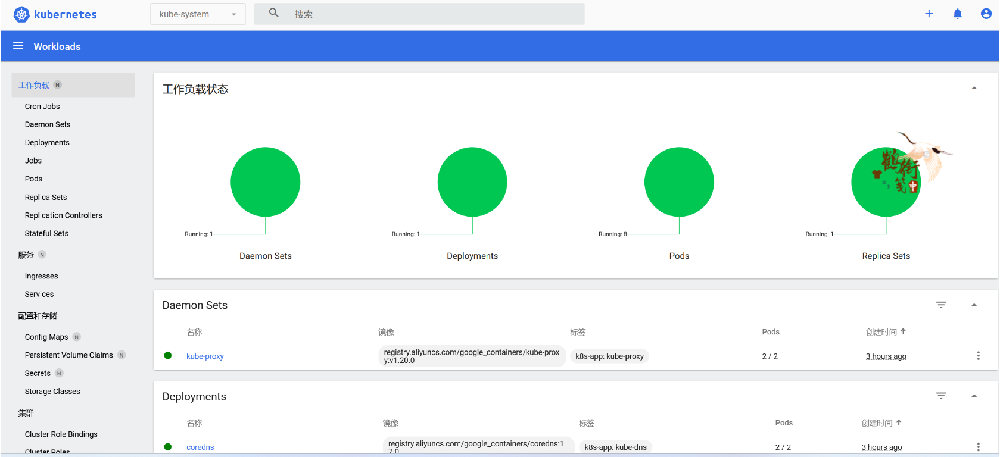
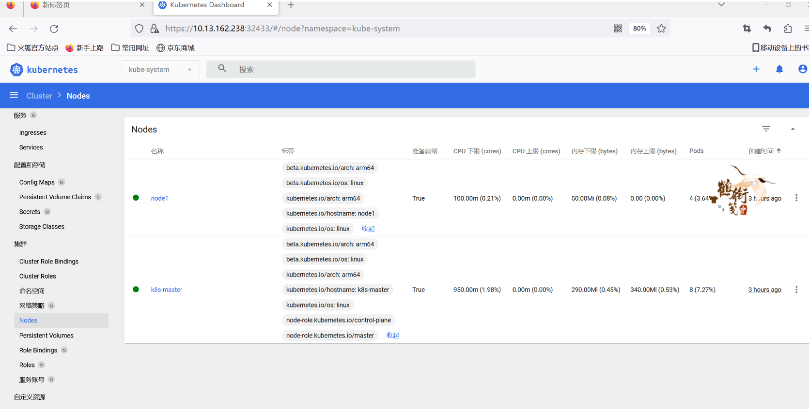
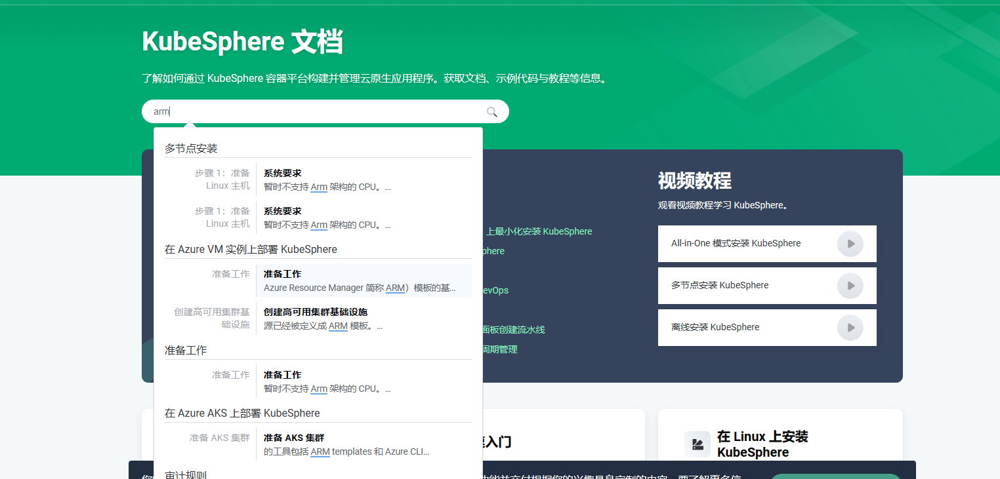

# 鲲鹏920 搭建k8s集群并安装dashboard

## 1、环境配置：

注：master和所有node节点都要执行

```bash
//关闭防火墙
systemctl stop firewalld
systemctl disable firewalld

//关闭selinux
sed -i 's/enforcing/disabled/' /etc/selinux/config
setenforce 0

//临时关闭 swap
swapoff -a

cat > /etc/sysctl.d/k8s.conf << EOF
net.bridge.bridge-nf-call-ip6tables = 1
net.bridge.bridge-nf-call-iptables = 1
EOF

sysctl --system

```

## 2、**安装时间同步服务器**

注：master和所有node节点都要执行

```bash
yum install chrony -y
systemctl enable chronyd.service
systemctl start chronyd.service

//查看chrony状态
systemctl status chronyd.service chronyc sources
● chronyd.service - NTP client/server
   Loaded: loaded (/usr/lib/systemd/system/chronyd.service; enabled; vendor preset: enabled)
   Active: active (running) since Mon 2021-03-22 14:32:33 CST; 11min ago
     Docs: man:chronyd(8)
           man:chrony.conf(5)
 Main PID: 611 (chronyd)
   CGroup: /system.slice/chronyd.service
           └─611 /usr/sbin/chronyd

Mar 22 14:32:33 localhost systemd[1]: Starting NTP client/server...
Mar 22 14:32:33 localhost chronyd[611]: chronyd version 3.4 starting (+CMDMON +NTP +REFCLOCK +RTC +PRIVDROP +SCFILTER +SIGND +ASYNCDNS +... +DEBUG)
Mar 22 14:32:33 localhost chronyd[611]: Frequency -3.712 +/- 0.085 ppm read from /var/lib/chrony/drift
Mar 22 14:32:33 localhost systemd[1]: Started NTP client/server.
Mar 22 14:32:38 k8s-master chronyd[611]: Selected source 100.125.0.251
```

## 3、安装所需依赖：

注：master和所有node节点都要执行

```bash
yum install -y conntrack ipvsadm ipset jq sysstat curl iptables libseccomp bash-completion yum-utils device-mapper-persistent-data lvm2 net-tools conntrack-tools vim libtool-ltdl
```

## 4、设置hostname

```bash
#设置每个机器自己的hostname
hostnamectl set-hostname xxx

eg:
作为主节点的服务器设置为：  hostnamectl set-hostname k8s-master
其余两台工作服务器  
第一台 ：hostnamectl set-hostname node1
第一台 ：hostnamectl set-hostname node2
```

之后让每台服务器都能找到master  设置host（每台服务器都执行）

```bash
echo "10.13.166.115  k8s-master" >> /etc/hosts  # 将IP 改为你master节点的IP
```

## 5、安装docker

注：master和所有node节点都要执行

```bash
sudo yum remove docker*
//配置repo
wget -O /etc/yum.repos.d/docker-ce.repo https://repo.huaweicloud.com/docker-ce/linux/centos/docker-ce.repo
sudo sed -i 's+download.docker.com+repo.huaweicloud.com/docker-ce+' /etc/yum.repos.d/docker-ce.repo
export releasever=7
export basearch=aarch64

//安装Docker-CE
sudo yum makecache
sudo yum -y install docker-ce-3:24.0.2-1.el8.aarch64 --allowerasing    # --allowerasing 表示允许安装新的替换旧的

//配置Docker-CE
systemctl start docker
systemctl enable docker.service
```

如果以上操作报错：找不到对应的daocker版本可以执行以下操作进行查找

```bash
yum list docker-ce
```

## 6、**安装kubeadm等组件**

注：master和所有node节点都要执行

```bash
# 设置镜像源
cat <<EOF > /etc/yum.repos.d/kubernetes.repo
[kubernetes]
name=Kubernetes
baseurl=http://mirrors.aliyun.com/kubernetes/yum/repos/kubernetes-el7-aarch64
enabled=1
gpgcheck=0
repo_gpgcheck=0
gpgkey=http://mirrors.aliyun.com/kubernetes/yum/doc/yum-key.gpg
       http://mirrors.aliyun.com/kubernetes/yum/doc/rpm-package-key.gpg
EOF

# 安装
yum install -y kubelet-1.20.0 kubeadm-1.20.0 kubectl-1.20.0 --disableexcludes=kubernetes 

#启动
systemctl enable kubelet
systemctl start kubelet --now
```

## 7、初始化master：

在初始化之前就提前解决一下这个问题：

**遇到问题**（其他警告可以置之不理，但是涉及到网络插件的必须解决 ）：

注意点：在其他节点也要执行 （比如加入work节点时要进行查看）

```bash
问题：
[WARNING FileExisting-tc]: tc not found in system path

解决：
dnf install -y iproute-tc
```


**初始化**：

仅在master 执行    将 `--apiserver-advertise-address=192.168.1.205 \` 其中的ip替换为master 的ip地址 

**重要：**  `--pod-network-cidr=172.168.0.0/16` 要根据集群的ip而定 从而避免ip冲突

```bash
kubeadm init \
--apiserver-advertise-address=192.168.1.205 \
--control-plane-endpoint=k8s-master \
--image-repository registry.aliyuncs.com/google_containers \
--kubernetes-version v1.20.0 \
--service-cidr=10.1.0.0/16 \
--pod-network-cidr=172.168.0.0/16
```


**取消初始化：（注意 这里不用执行哦，只有报错或者想重试才执行以下代码）**比如遇到上面的报错 解决后再重新初始化master节点

```bash
sudo kubeadm reset

rm -rf $HOME/.kube

rm -rf /var/lib/cni/
rm -rf /etc/cni/
ifconfig cni0 down
ip link delete cni0
```



执行完以上命令后 会 删除所有的容器 docker 以及 pod


**详细信息：**

执行完初始化后 会产生详细信息： （注意这里要将其记录下来，后面加入node节点会使用到）

```bash
Your Kubernetes control-plane has initialized successfully!

To start using your cluster, you need to run the following as a regular user:

  mkdir -p $HOME/.kube
  sudo cp -i /etc/kubernetes/admin.conf $HOME/.kube/config
  sudo chown $(id -u):$(id -g) $HOME/.kube/config

Alternatively, if you are the root user, you can run:

  export KUBECONFIG=/etc/kubernetes/admin.conf

You should now deploy a pod network to the cluster.
Run "kubectl apply -f [podnetwork].yaml" with one of the options listed at:
  https://kubernetes.io/docs/concepts/cluster-administration/addons/

You can now join any number of control-plane nodes by copying certificate authorities
and service account keys on each node and then running the following as root:

  kubeadm join k8s-master:6443 --token 02f7y1.k9dgww0wcobl0s9c \
    --discovery-token-ca-cert-hash sha256:07b802f242cfb73780d757e056978731a822fcc339ba4c9ee95afa5a64819090 \
    --control-plane 

Then you can join any number of worker nodes by running the following on each as root:

kubeadm join k8s-master:6443 --token 02f7y1.k9dgww0wcobl0s9c \
    --discovery-token-ca-cert-hash sha256:07b802f242cfb73780d757e056978731a822fcc339ba4c9ee95afa5a64819090 

```


之后在master节点执行（详细信息中内容）

```bash
  mkdir -p $HOME/.kube
  sudo cp -i /etc/kubernetes/admin.conf $HOME/.kube/config
  sudo chown $(id -u):$(id -g) $HOME/.kube/config
```

稍等一下 查看结果：

**可以看到doredns 还没有启动 这两个需要安装 网络插件之后才会正式的running 起来 所以不要着急**


## 8、部署容器网络插件：

注：仅在master节点执行

```bash
kubectl apply -f https://raw.githubusercontent.com/coreos/flannel/master/Documentation/kube-flannel.yml
```

若拉取不到上面的文件 可以直接 copy 附录中的进行应用即可


**遇到问题：**

**问题一：**

 coredns 的状态一直为 ContainerCreating
错误原因：查看该节点状态，发现缺少/run/flannel/subnet.env文件

```
kubectl describe pod coredns-6d8c4cb4d-drcgw -n kube-system
#logs 输出：
kubernetes installation and kube-dns: open /run/flannel/subnet.env: no such file or directory
```

解决方案：手动写入/run/flannel/subnet.env文件，再次查看为running

```bash
cat > /run/flannel/subnet.env << EOF
FLANNEL_NETWORK=172.100.0.0/16
FLANNEL_SUBNET=172.100.1.0/24
FLANNEL_MTU=1450
FLANNEL_IPMASQ=true
EOF
```

**问题二、**

问题描述
部署flannel网络插件失败：

```bash
NAMESPACE      NAME                             READY   STATUS              RESTARTS   AGE
kube-flannel   kube-flannel-ds-55nbz            0/1     CrashLoopBackOff    3          2m48s
```

原因分析：
查看pod日志：kubectl get pod -n kube-flannel kube-flannel-ds-55nbz

```bash
E0825 09:00:25.015344       1 main.go:330] Error registering network: failed to acquire lease: subnet "10.244.0.0/16" specified in the flannel net config doesn't contain "172.16.0.0/24" PodCIDR of the "master" node.
W0825 09:00:25.018642       1 reflector.go:436] github.com/flannel-io/flannel/subnet/kube/kube.go:403: watch of *v1.Node ended with: an error on the server ("unable to decode an event from the watch stream: context canceled") has prevented the request from succeeding
I0825 09:00:25.018698       1 main.go:447] Stopping shutdownHandler...
```

原因：初始化master节点时，指定了–pod-network-cidr=172.16.0.0/16
那么，kube-flannel.yml中该部分网段也要进行对应，默认是“10.244.0.0/16”

**解决方案：**

```bash
vi kube-flannel.yml

 
 # 修改位置
 net-conf.json: |
    {
      "Network": "172.168.0.0/16", #  修改为 master初始化时 pod 的网段
      "Backend": {
        "Type": "vxlan"
      }
    }

```


**执行以上更改后重新应用：**

```bash
kubectl delete -f kube-flannel.yml

kubectl apply -f kube-flannel.yml
```


## 9、加入工作节点：

提前解决 一会执行后会遇到的问题


**遇到问题：**

Warning：detected "cgroupfs" as the Docker cgroup driver. The recommended driver is "systemd".

[警告IsDockerSystemdCheck]：检测到“cgroupfs”作为Docker cgroup驱动程序。 推荐的驱动程序是“systemd”。

所以我们更换一下驱动。

**解决方法：修改docker**

在/etc/docker下创建daemon.json并编辑：

```
vi /etc/docker/daemon.json
```

加入以下内容：

```csharp
{
 "exec-opts":["native.cgroupdriver=systemd"]
}
```




重启docker

```bash
systemctl restart docker
systemctl status docker
```


注：仅在node节点执行

具体的token 来自于 kubeadm init 时 生成的 详情中的内容 中

```bash
kubeadm join k8s-master:6443 --token 02f7y1.k9dgww0wcobl0s9c \
    --discovery-token-ca-cert-hash sha256:07b802f242cfb73780d757e056978731a822fcc339ba4c9ee95afa5a64819090
```


## 10、安装 k8s dashboard：

**注：仅在master节点执行**

### 1、部署

kubernetes官方提供的可视化界面

https://github.com/kubernetes/dashboard

```bash
kubectl apply -f https://raw.githubusercontent.com/kubernetes/dashboard/v2.3.1/aio/deploy/recommended.yaml
```


### 2、设置访问端口

```bash
kubectl edit svc kubernetes-dashboard -n kubernetes-dashboard
```


**执行以上命令会打开一个文件  将其中的 type: ClusterIP 改为 type: NodePort**

查看：

```bash
kubectl get svc -A |grep kubernetes-dashboard
```



### 3、创建访问账号

1. vi dash.yaml  粘贴以下内容 就会创建一个用户 admin—user

   ```yaml
   #创建访问账号，准备一个yaml文件； vi dash.yaml
   apiVersion: v1
   kind: ServiceAccount
   metadata:
     name: admin-user
     namespace: kubernetes-dashboard
   ---
   apiVersion: rbac.authorization.k8s.io/v1
   kind: ClusterRoleBinding
   metadata:
     name: admin-user
   roleRef:
     apiGroup: rbac.authorization.k8s.io
     kind: ClusterRole
     name: cluster-admin
   subjects:
   - kind: ServiceAccount
     name: admin-user
     namespace: kubernetes-dashboard
   ```

2. 执行：

   ```
   kubectl apply -f dash.yaml
   ```

   创建用户成功：

### 4、令牌访问

```bash
#获取访问令牌
kubectl -n kubernetes-dashboard get secret $(kubectl -n kubernetes-dashboard get sa/admin-user -o jsonpath="{.secrets[0].name}") -o go-template="{{.data.token | base64decode}}"
```

令牌：

```bash
eyJhbGciOiJSUzI1NiIsImtpZCI6ImlDd2FhalJURElqcFlhaG81Q2ViZVNJejJmekJVdVR3eWszbEl1WkNjOWsifQ.eyJpc3MiOiJrdWJlcm5ldGVzL3NlcnZpY2VhY2NvdW50Iiwia3ViZXJuZXRlcy5pby9zZXJ2aWNlYWNjb3VudC9uYW1lc3BhY2UiOiJrdWJlcm5ldGVzLWRhc2hib2FyZCIsImt1YmVybmV0ZXMuaW8vc2VydmljZWFjY291bnQvc2VjcmV0Lm5hbWUiOiJhZG1pbi11c2VyLXRva2VuLTRndDJ0Iiwia3ViZXJuZXRlcy5pby9zZXJ2aWNlYWNjb3VudC9zZXJ2aWNlLWFjY291bnQubmFtZSI6ImFkbWluLXVzZXIiLCJrdWJlcm5ldGVzLmlvL3NlcnZpY2VhY2NvdW50L3NlcnZpY2UtYWNjb3VudC51aWQiOiJjYjUxZjBiOC02MDYzLTRlNDktODY0Mi0yNWI0YWNhNmUxYTEiLCJzdWIiOiJzeXN0ZW06c2VydmljZWFjY291bnQ6a3ViZXJuZXRlcy1kYXNoYm9hcmQ6YWRtaW4tdXNlciJ9.roM2nTjHy5zeMgOdHFvS5pEJe2gLvYBs3Fax15BQgOCqKrUK8DpE7LYRQLoANFfXPMqJEjz-Q5QObwZKq7HoVAJNqyKp4m78SVRvwmBTO_PG6uCgUKFQ44vxFDdMarKs5Mn2Pzcl7pe-Cu8vUBo1XhUnDroJMFHMhXcSzfxcmPkNSrWfTcj8s48nDp5bIKFweuRQ0B6Ash4jUTvMIyr02GdzNAWhU9QOjXg8HYQGceLyrAvIgO2Li4D9yrlSJZaJeKPhQumvt0-I2kvI_fmW6rJcMNxBLwNMX0ickuw68km_Mbtyx14fcTwOpZ8YI0YjsByUeQ_87qtB82kc3lZsyQ
```


### 5、界面

注意点 要使用 火狐浏览器访问 因为这里暂时还没有配置证书 （因为证书比较老 要换新）。






**后言：**

**我也很想在这个集群上搭建kubesphere 但是kubesphere 现在还不支持 arm 的cpu 所有暂时还不能实现 **




## 附录：


### kube-flannel.yml：

```bash
---
kind: Namespace
apiVersion: v1
metadata:
  name: kube-flannel
  labels:
    k8s-app: flannel
    pod-security.kubernetes.io/enforce: privileged
---
kind: ClusterRole
apiVersion: rbac.authorization.k8s.io/v1
metadata:
  labels:
    k8s-app: flannel
  name: flannel
rules:
- apiGroups:
  - ""
  resources:
  - pods
  verbs:
  - get
- apiGroups:
  - ""
  resources:
  - nodes
  verbs:
  - get
  - list
  - watch
- apiGroups:
  - ""
  resources:
  - nodes/status
  verbs:
  - patch
- apiGroups:
  - networking.k8s.io
  resources:
  - clustercidrs
  verbs:
  - list
  - watch
---
kind: ClusterRoleBinding
apiVersion: rbac.authorization.k8s.io/v1
metadata:
  labels:
    k8s-app: flannel
  name: flannel
roleRef:
  apiGroup: rbac.authorization.k8s.io
  kind: ClusterRole
  name: flannel
subjects:
- kind: ServiceAccount
  name: flannel
  namespace: kube-flannel
---
apiVersion: v1
kind: ServiceAccount
metadata:
  labels:
    k8s-app: flannel
  name: flannel
  namespace: kube-flannel
---
kind: ConfigMap
apiVersion: v1
metadata:
  name: kube-flannel-cfg
  namespace: kube-flannel
  labels:
    tier: node
    k8s-app: flannel
    app: flannel
data:
  cni-conf.json: |
    {
      "name": "cbr0",
      "cniVersion": "0.3.1",
      "plugins": [
        {
          "type": "flannel",
          "delegate": {
            "hairpinMode": true,
            "isDefaultGateway": true
          }
        },
        {
          "type": "portmap",
          "capabilities": {
            "portMappings": true
          }
        }
      ]
    }
  net-conf.json: |
    {
      "Network": "192.168.0.0/16",
      "Backend": {
        "Type": "vxlan"
      }
    }
---
apiVersion: apps/v1
kind: DaemonSet
metadata:
  name: kube-flannel-ds
  namespace: kube-flannel
  labels:
    tier: node
    app: flannel
    k8s-app: flannel
spec:
  selector:
    matchLabels:
      app: flannel
  template:
    metadata:
      labels:
        tier: node
        app: flannel
    spec:
      affinity:
        nodeAffinity:
          requiredDuringSchedulingIgnoredDuringExecution:
            nodeSelectorTerms:
            - matchExpressions:
              - key: kubernetes.io/os
                operator: In
                values:
                - linux
      hostNetwork: true
      priorityClassName: system-node-critical
      tolerations:
      - operator: Exists
        effect: NoSchedule
      serviceAccountName: flannel
      initContainers:
      - name: install-cni-plugin
        image: docker.io/flannel/flannel-cni-plugin:v1.1.2
       #image: docker.io/rancher/mirrored-flannelcni-flannel-cni-plugin:v1.1.2
        command:
        - cp
        args:
        - -f
        - /flannel
        - /opt/cni/bin/flannel
        volumeMounts:
        - name: cni-plugin
          mountPath: /opt/cni/bin
      - name: install-cni
        image: docker.io/flannel/flannel:v0.22.0
       #image: docker.io/rancher/mirrored-flannelcni-flannel:v0.22.0
        command:
        - cp
        args:
        - -f
        - /etc/kube-flannel/cni-conf.json
        - /etc/cni/net.d/10-flannel.conflist
        volumeMounts:
        - name: cni
          mountPath: /etc/cni/net.d
        - name: flannel-cfg
          mountPath: /etc/kube-flannel/
      containers:
      - name: kube-flannel
        image: docker.io/flannel/flannel:v0.22.0
       #image: docker.io/rancher/mirrored-flannelcni-flannel:v0.22.0
        command:
        - /opt/bin/flanneld
        args:
        - --ip-masq
        - --kube-subnet-mgr
        resources:
          requests:
            cpu: "100m"
            memory: "50Mi"
        securityContext:
          privileged: false
          capabilities:
            add: ["NET_ADMIN", "NET_RAW"]
        env:
        - name: POD_NAME
          valueFrom:
            fieldRef:
              fieldPath: metadata.name
        - name: POD_NAMESPACE
          valueFrom:
            fieldRef:
              fieldPath: metadata.namespace
        - name: EVENT_QUEUE_DEPTH
          value: "5000"
        volumeMounts:
        - name: run
          mountPath: /run/flannel
        - name: flannel-cfg
          mountPath: /etc/kube-flannel/
        - name: xtables-lock
          mountPath: /run/xtables.lock
      volumes:
      - name: run
        hostPath:
          path: /run/flannel
      - name: cni-plugin
        hostPath:
          path: /opt/cni/bin
      - name: cni
        hostPath:
          path: /etc/cni/net.d
      - name: flannel-cfg
        configMap:
          name: kube-flannel-cfg
      - name: xtables-lock
        hostPath:
          path: /run/xtables.lock
          type: FileOrCreate
```

